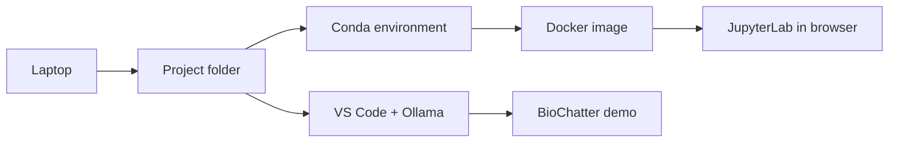

# How to Set Up Your Laptop for Bioinformatics

**Takeaway:** A good bioinformatics setup is not a pile of tools. It is a small, repeatable system that lets you start a project, install packages, run notebooks, test command-line tools, and get local coding help without turning your laptop into a mystery box.

## Why This Setup Matters

Most beginners do not get stuck because they are bad at biology or coding. They get stuck because the setup becomes impossible to reason about: one tool came from `pip`, another from a random installer, the notebook worked last month, and the results are scattered across `Downloads` and Desktop.

By the end, you will have:

- One clean project folder.
- One Conda environment for everyday bioinformatics.
- One Docker setup for reproducible notebooks.
- One sanity check that proves the tools work.
- One local coding assistant using Ollama and Continue.

Save this post. Week 2 builds on it.

## Prerequisites

None. You only need to open a terminal and copy commands carefully.

## The Mental Model

Think of your setup as four layers:

| Layer | Plain-English job | Tool in this guide |
|---|---|---|
| Project folder | Keeps files findable | A standard folder template |
| Conda environment | Installs analysis tools | `environment.yml` |
| Docker container | Makes the setup portable | `Dockerfile` and `docker-compose.yml` |
| Local assistant | Helps with code and errors | Ollama plus Continue |

Use Conda while learning. Use Docker when sharing or teaching. Use Git for anything you might want to explain later.



If this feels like a lot, do it in stages:

| Stage | Do this first | Why |
|---|---|---|
| Required | Project folder, Conda environment, sanity check | Enough to start Week 2 safely |
| Next | Docker and JupyterLab | Makes the setup easier to share and rerun |
| Optional | Ollama, Continue, BioChatter | Adds local coding help after the basics work |

Tested setup for this draft: macOS, Conda, Docker/Colima, JupyterLab, Ollama, Continue, and BioChatter.

## Step 1: Choose Your Terminal Path

### If You Use a Mac

Recommended tools: Terminal or iTerm2, Homebrew, Miniforge or Anaconda, VS Code, Docker Desktop or Docker CLI plus Colima, and Ollama. For a fresh machine, I prefer Miniforge because it starts close to the `conda-forge` ecosystem that bioinformatics often relies on.

### If You Use Windows

Use WSL2 with Ubuntu. Most bioinformatics tools expect a Linux-like shell, and WSL2 lets you follow nearly the same commands as Mac and Linux users. Install Windows Terminal, Ubuntu through WSL2, Miniforge inside Ubuntu, VS Code with the WSL extension, Docker Desktop with WSL integration, and Ollama.

Keep early projects inside your WSL home folder:

```bash
mkdir -p ~/bioinformatics/projects
cd ~/bioinformatics/projects
```

Keep early projects inside WSL, not the Windows Desktop, until you understand how WSL handles files.

## Step 2: Create One Project Folder

Before installing more tools, create a place where work belongs:

```bash
mkdir -p ~/bioinformatics/projects/week-01-setup
cd ~/bioinformatics/projects/week-01-setup
```

Every real project should eventually look like this:

```text
project-name/
  README.md
  environment.yml
  Dockerfile
  docker-compose.yml
  data/
    raw/
    processed/
  metadata/
  notebooks/
  scripts/
  results/
  figures/
  references/
```

The rule that saves you later: `data/raw/` is original input and should not be edited by hand. Put scripts in `scripts/`, notebooks in `notebooks/`, tables in `results/`, and plots in `figures/`.

## Step 3: Set Up Conda Correctly

Conda creates named software environments. That matters because bioinformatics tools often need specific versions of Python, R, command-line tools, and libraries. One global environment becomes fragile fast.

Configure channels once:

```bash
conda config --add channels bioconda
conda config --add channels conda-forge
conda config --set channel_priority strict
```

This looks backward at first, so here is the key detail: `conda config --add channels ...` adds each new channel to the top of the priority list. That means after the two commands above, `conda-forge` should appear above `bioconda`.

Check it:

```bash
conda config --show channels
```

You want to see:

```text
channels:
  - conda-forge
  - bioconda
```

Why this order? Bioconda packages depend heavily on `conda-forge`, so `conda-forge` should have higher priority. Strict channel priority tells Conda to respect that order, which usually makes dependency solving more predictable.

Create the starter environment:

```bash
conda env create -f content/resources/week-01/environment.yml
```

This may take several minutes. It installs Python, R, JupyterLab, scientific Python packages, and tools including `samtools`, `bcftools`, `bedtools`, `seqkit`, `fastqc`, `multiqc`, and `nextflow`.

Activate it:

```bash
conda activate bioinfo-starter
```

When you are done working:

```bash
conda deactivate
```

For future projects, commit `environment.yml` with Git. It is the receipt for what the project needed.

## Step 4: Run the Sanity Check

Run this after activating `bioinfo-starter`:

```bash
python --version
R --version | head -n 1
samtools --version | head -n 1
seqkit version
multiqc --version
nextflow -version | head -n 3
```

You should see version numbers, not "command not found."

Then test a tiny Python table:

```bash
python - <<'PY'
import pandas as pd

df = pd.DataFrame({
    "sample": ["control", "treated"],
    "reads": [1000, 1500],
})
print(df)
PY
```

If that works, your everyday analysis environment is ready.

## Step 5: Understand Docker Before You Use It

Docker packages an environment into a container: a repeatable software room with its own tools, versions, and startup command. Conda asks, "Can I install the tools I need here?" Docker asks, "Can someone else run this same setup without rebuilding their laptop?"

Use Conda for learning and most local analysis. Use Docker for tutorials, workshops, reproducible demos, and anything you want another person to rerun.

## Step 6: Build the Docker Version

If you use Docker Desktop, open Docker Desktop first.

If Docker Desktop is not available or is awkward to install on Mac, use Homebrew with Colima:

```bash
brew install docker docker-compose colima
colima start --cpu 2 --memory 4 --disk 20
```

Build the image:

```bash
cd content/resources/week-01
docker compose build
```

This can take several minutes. Docker is creating an image: a reusable package that contains Linux plus the `bioinfo-starter` Conda environment. In other words, Conda is being installed inside the Docker image so the same tools can run later without depending on your laptop's base setup.

Now start JupyterLab. Run this in your normal terminal, still inside the `content/resources/week-01` folder:

```bash
docker compose up
```

This command is not typed inside JupyterLab. It starts JupyterLab for you.

What this does:

- Reads `docker-compose.yml`.
- Starts the `bioinfo-starter` service.
- Runs the software stack from the Docker image, not from your laptop's global setup.
- Connects port `8888` inside the container to port `8888` on your laptop.
- Mounts the local `workspace/` folder into the container at `/workspace`.

After `docker compose up` starts, keep that terminal open. Then open this URL in your web browser:

```text
http://localhost:8888/lab?token=bioinfo
```

What is happening here?

- JupyterLab is running inside the Docker container.
- Your browser is only the window you use to interact with it.
- The token `bioinfo` is the simple password set by this tutorial's Docker command.

Why JupyterLab? It gives beginners a friendly browser workspace for notebooks, terminals, small Python/R checks, and quick plots. In this Docker setup, you get that workspace without installing the notebook stack directly into your base laptop environment.

Inside JupyterLab, open **Terminal** and run:

```bash
seqkit stats /workspace/demo/mini.fasta
```

You should see a small table describing the FASTA file, including the number of sequences and total length. That is the Docker idea in miniature: your files stay local, but the software environment is controlled.

The important part is the mounted folder. Anything you save under `/workspace` in JupyterLab is really saved in this local folder:

```text
content/resources/week-01/workspace/
```

That means your notebooks, scripts, and toy data stay on your computer even if the container stops or gets rebuilt.

When you are done, stop the container:

```bash
docker compose down
```

This removes the running container and its temporary network. It does not delete the files you saved in `workspace/`.

Prefer a no-browser Docker test? From the same `content/resources/week-01` folder, run:

```bash
docker compose run --rm bioinfo-starter \
  conda run -n bioinfo-starter seqkit stats /workspace/demo/mini.fasta
```

Here, `docker compose run` starts a temporary container, `seqkit stats` runs inside it, and `--rm` cleans up afterward.

## Step 7: Add a Local Coding Assistant

A local coding assistant can explain terminal errors, draft small Python or R scripts, clean up READMEs, and help turn notebooks into reusable scripts without sending every question to a cloud service.

Install Ollama and pull a coding model:

```bash
brew install ollama
OLLAMA_FLASH_ATTENTION=1 OLLAMA_KV_CACHE_TYPE=q8_0 ollama serve
```

Leave that terminal open. In a second terminal, run:

```bash
ollama pull qwen2.5-coder:7b
```

Install the Continue extension in VS Code:

```bash
code --install-extension continue.continue
```

Then copy the included Continue config:

```bash
mkdir -p ~/.continue
cp content/resources/week-01/continue-config.yaml ~/.continue/config.yaml
```

Open VS Code from the blog folder:

```bash
code .
```

In VS Code:

1. Open the Continue panel.
2. Select `Qwen2.5 Coder 7B Local`.
3. Ask a small setup question, such as:

```text
Explain what the environment.yml file in this folder installs. Flag anything that looks unnecessary for a beginner.
```

You can also highlight the Docker demo command and ask:

```text
Explain this command line by line for a beginner.
```

To check that Ollama is reachable:

```bash
ollama list
ollama run qwen2.5-coder:7b "In one sentence, what is samtools used for?"
```

## Step 8: Add a Bioinformatics-Specific AI Sidecar

Keep the AI setup simple: use Continue + Ollama for coding inside VS Code, then add one bioinformatics-specific sidecar for domain-aware experiments. The included `continue-config.yaml` adds guardrails: do not invent citations, do not overinterpret biology, ask for evidence when missing, and prefer reproducible scripts.

In Continue, try one review prompt:

```text
/bioinformatics-review
Review this script for reproducibility, biological assumptions, missing citations, data privacy risks, and beginner clarity.
```

This works well because Continue stays close to your files, terminal output, Git diff, and notebooks.

For a free bioinformatics agent, the best choice depends on the job:

| Tool | Use it when | Beginner verdict |
|---|---|---|
| BioChatter | You want to build biomedical chat or knowledge-graph-aware workflows in Python, with local LLM support through Ollama. | Best Week 1 choice because the demo can stay small, local, and inspectable. |
| BRAD | You want a bioinformatics assistant for literature/database search, RAG, gene enrichment, software execution, or GUI-style exploration. | More directly agent-shaped, but heavier than this first setup. |
| ClawBio | You want runnable, reproducible bioinformatics skills and demo workflows. | Promising for skill-based workflows; verify outputs carefully because the ecosystem is newer. |

For Week 1, use BioChatter. It is a Python framework for biomedical chat workflows, and it can connect to local Ollama models. Keep it in a separate Conda environment so your core analysis setup stays clean.

Create the environment:

```bash
conda create -n biochatter-agent python=3.12 pip
conda activate biochatter-agent
pip install biochatter
```

Run the tiny demo:

```bash
python content/resources/week-01/biochatter_ollama_demo.py
```

The demo connects BioChatter to your local `qwen2.5-coder:7b` Ollama model and asks it to explain columns from the `seqkit stats` output. This is deliberately small: first make the assistant explain observed output, then build toward more complex workflows later.

Run this from the VS Code terminal, not inside your main `bioinfo-starter` environment. Keeping agent experiments separate makes your analysis environment easier to debug.

Important: local does not automatically mean risk-free. Do not paste protected health information, private credentials, unpublished manuscripts, collaborator data, or proprietary files into any assistant unless you understand the data boundary and policy. For biology, statistics, and clinical claims, go back to the paper, documentation, or dataset.

## What Success Looks Like

You are ready for Week 2 when `bioinfo-starter` activates, Python/R/`samtools`/`seqkit`/`multiqc`/`nextflow` return versions, Docker can run the tiny FASTA demo, JupyterLab opens from the container, and Continue, Ollama, and the BioChatter demo work locally.

## What Experts Still Debate

People disagree about the best first setup: Conda first, containers first, or workflows first. My staged recommendation is simpler: learn folders and the terminal, use Conda for first analyses, use Docker when sharing or teaching, add Nextflow or Snakemake when a workflow must run repeatedly, and treat AI assistants as support rather than authority.

## Original Asset

This post includes five starter files:

- `environment.yml`: a Conda environment for beginner bioinformatics.
- `Dockerfile`: a portable container image for the same starter stack.
- `docker-compose.yml`: a one-command JupyterLab workspace.
- `continue-config.yaml`: a local coding assistant configuration for VS Code and Ollama.
- `biochatter_ollama_demo.py`: a tiny BioChatter demo that talks to a local Ollama model.

## Credits and References

- Bioconda documentation: https://bioconda.github.io/
- Conda channel priority documentation: https://docs.conda.io/projects/conda/en/stable/user-guide/tasks/manage-channels.html
- Miniforge: https://github.com/conda-forge/miniforge
- Dockerfile reference: https://docs.docker.com/reference/dockerfile/
- Docker Compose documentation: https://docs.docker.com/compose/
- Colima: https://github.com/abiosoft/colima
- Ollama quickstart: https://docs.ollama.com/quickstart
- Continue Ollama guide: https://docs.continue.dev/guides/ollama-guide
- Continue config reference: https://docs.continue.dev/reference
- BioChatter: https://biochatter.org/
- BioChatter local Ollama models: https://biocypher.org/BioChatter/features/open-llm/
- BRAD bioinformatics assistant: https://github.com/jpickard1/brad
- ClawBio: https://clawbio.ai/
- Visual Studio Code: https://code.visualstudio.com/
- Windows Subsystem for Linux documentation: https://learn.microsoft.com/windows/wsl/

## Expert Review Checklist

- Conda environment tested on macOS.
- Docker image built with Colima on macOS.
- JupyterLab container reached at `localhost:8888`.
- Tiny FASTA Docker demo tested with `seqkit stats`.
- Ollama model downloaded and tested locally.
- Continue extension installed in VS Code.
- BioChatter demo tested against local Ollama.
- Add screenshots after the final site design exists.
- Add a tiny FASTQ/QC exercise before publication.
