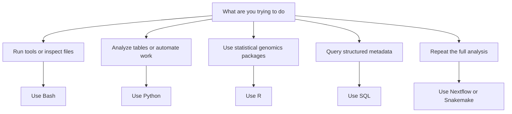

# What Languages Should a Bioinformatician Know?

**Takeaway:** You do not need to learn every language at once. Learn enough Bash to move through files, enough Python or R to analyze data, enough SQL to respect metadata, and enough workflow thinking to make your work repeatable.

## Start With The Job, Not The Language

Beginners often ask, "Should I learn Python or R?" A better question is:

```text
What kind of bioinformatics work am I trying to do?
```

Languages are tools. The goal is not to collect them. The goal is to know which one fits the problem in front of you.

| Job | Best first tool | Why |
|---|---|---|
| Move around files and run bioinformatics tools | Bash | Most command-line tools expect a Unix-like shell |
| Clean tables, write scripts, call APIs, use ML | Python | General-purpose, readable, and strong for automation |
| RNA-seq statistics, plots, Bioconductor workflows | R | Excellent statistical genomics ecosystem |
| Query sample sheets, clinical tables, warehouses | SQL | Forces precise thinking about metadata and joins |
| Rerun the same analysis many times | Nextflow or Snakemake | Turns commands into reproducible workflows |

## The Beginner Order That Works

If you are starting from zero, use this order:

1. **Bash basics:** paths, files, pipes, and running tools.
2. **Python or R:** choose one as your first analysis language.
3. **The other analysis language:** add it after you can finish small tasks.
4. **SQL:** learn joins and grouping before your metadata gets messy.
5. **Workflow systems:** add Nextflow or Snakemake when you repeat analyses.

Do not try to master everything in one month. Aim for useful fluency.

## Bash: The Glue Layer

Bash is how you talk to files and command-line tools. Sequencing data is often too large for spreadsheets, and many bioinformatics tools are designed for the terminal.

Learn these first:

```bash
pwd
ls
cd
mkdir
cp
mv
head
tail
wc
grep
cut
sort
uniq
```

Then learn pipes:

```bash
cat samples.tsv | cut -f2 | sort | uniq -c
```

You do not need to become a systems engineer. You do need to stop being afraid of paths, files, and command output.

## Python: The Builder

Python is a strong first analysis language if you want to clean data, automate work, build tools, use APIs, or learn machine learning.

Start with:

| Package | Use |
|---|---|
| `pandas` | tables and metadata |
| `numpy` | arrays and numerical work |
| `matplotlib` / `seaborn` | plotting |
| `scipy` | statistics and scientific computing |
| `scikit-learn` | machine learning |
| `biopython` | sequence and biological file utilities |

Python is often the best choice when you need to build something reusable for yourself or a team.

## R: The Statistical Genomics Workbench

R is especially strong when the analysis is close to statistics, visualization, and Bioconductor.

Start with:

| Package | Use |
|---|---|
| `tidyverse` | data wrangling |
| `ggplot2` | visualization |
| `DESeq2` | RNA-seq differential expression |
| `edgeR` | count-based statistical modeling |
| `limma` | linear modeling and omics workflows |
| `Seurat` | single-cell analysis |

R is often the best choice when a trusted method already exists in Bioconductor or when the question is statistical first.

## SQL: The Metadata Superpower

Bioinformatics fails quietly when metadata is messy. SQL helps you ask precise questions:

```sql
SELECT condition, COUNT(*) AS n_samples
FROM samples
GROUP BY condition;
```

Learn:

- `SELECT`
- `WHERE`
- `GROUP BY`
- `JOIN`
- `ORDER BY`
- primary keys
- sample identifiers

SQL makes you better at spotting duplicated samples, inconsistent labels, missing covariates, and broken joins.

## The Decision Map



## Common Mistakes

- Learning syntax without learning file paths.
- Treating notebooks as the only record of analysis.
- Copying code without understanding objects and inputs.
- Using Python for everything because it feels familiar.
- Using R for everything because a package exists.
- Ignoring metadata until the end.
- Starting workflow systems before understanding the commands they run.

## Save This: A Four-Week Starter Plan

| Week | Goal | Tiny project |
|---|---|---|
| 1 | Bash | Count rows, inspect FASTA/FASTQ-like files, summarize sample names |
| 2 | Python | Read a metadata table, clean columns, make one plot |
| 3 | R | Read a count matrix, join metadata, make a basic expression plot |
| 4 | SQL | Create two small tables and join samples to annotations |

By the end, you should be able to explain what each language is doing in one sentence.

## What To Watch Next

The mature answer is not Python vs R. Real bioinformatics teams use whatever combination makes the analysis correct, readable, and reproducible. The best analysts are language-flexible but evidence-strict.

## Credits and References

- Python: https://www.python.org/
- R Project: https://www.r-project.org/
- Bioconductor: https://www.bioconductor.org/
- pandas documentation: https://pandas.pydata.org/docs/
- tidyverse: https://www.tidyverse.org/
- Scanpy documentation: https://scanpy.readthedocs.io/
- Seurat documentation: https://satijalab.org/seurat/
- Nextflow: https://www.nextflow.io/
- Snakemake: https://snakemake.readthedocs.io/
