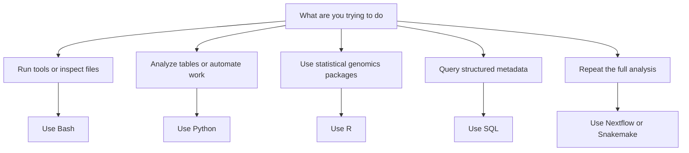

# What Programming Languages Should a Bioinformatician Know?

**Takeaway:** You do not need to learn every language at once. Learn Bash to move through files, choose Python or R as your first analysis language, use SQL to protect your metadata, and add workflow tools when your analysis needs to run again.

## Start With The Job, Not The Language

Beginners usually ask, "Should I learn Python or R?"

That question matters, but it is not the first question. Start here:

```text
What kind of bioinformatics work am I trying to do?
```

Bioinformatics is not one job. Some days you inspect sequencing files. Some days you clean metadata. Some days you fit statistical models. Some days you rerun a pipeline because one sample failed quality control.

Different jobs need different tools.

| Job | Best first tool | Why |
|---|---|---|
| Move around files and run command-line tools | Bash | Most bioinformatics tools expect a Unix-like shell |
| Clean tables, call APIs, automate work, use ML | Python | General-purpose, readable, and strong for reusable scripts |
| Run statistical genomics methods and make publication plots | R | Excellent ecosystem for statistics, visualization, and Bioconductor |
| Check sample sheets, clinical tables, and study metadata | SQL | Makes joins, duplicates, and missing values explicit |
| Rerun the same analysis across many samples | Nextflow or Snakemake | Turns one-off commands into reproducible workflows |

## The Beginner Order That Works

If you are starting from zero, use this order:

1. **Bash basics:** paths, files, pipes, and running tools from the terminal.
2. **Python or R:** choose one as your first analysis language.
3. **The other analysis language:** add it after you can finish small tasks without copying blindly.
4. **SQL:** learn joins and grouping before your metadata becomes a quiet source of errors.
5. **Workflow systems:** add Nextflow or Snakemake when you repeat the same commands across samples.

Do not try to master everything in one month. Aim for useful fluency.

If you read [Week 1](week-01-laptop-setup-for-bioinformatics.html), you already have the setup you need: a project folder, Conda environment, terminal, and editor. This week is about deciding what to learn first.

## Bash: The Glue Layer

Bash is how you talk to files and command-line tools. Sequencing data is often too large for spreadsheets, and many bioinformatics tools are designed to run from a terminal.

Learn these first:

```bash
pwd
ls
cd
mkdir
cp
mv
head
tail
wc
grep
cut
sort
uniq
```

Then learn pipes:

```bash
cut -f2 samples.tsv | sort | uniq -c
```

That command means: take column 2, sort the values, and count each unique value.

You do not need to become a systems engineer. You do need to stop being afraid of paths, files, and command output. If you can find files, inspect headers, count rows, and run one tool safely, you are already doing real bioinformatics.

## Python: The Builder

Python is a strong first analysis language if you want to clean data, automate work, build tools, use APIs, or learn machine learning.

Start with:

| Package | Use |
|---|---|
| `pandas` | tables and metadata |
| `numpy` | arrays and numerical work |
| `matplotlib` / `seaborn` | plotting |
| `scipy` | statistics and scientific computing |
| `scikit-learn` | machine learning |
| `biopython` | sequence and biological file utilities |
| `scanpy` / `anndata` | single-cell data structures and analysis |

Python is often the best choice when you need to build something reusable for yourself or a team: a data-cleaning script, a small command-line utility, a dashboard prototype, a model-training workflow, or an API client.

Choose Python first if your instinct is, "I want to automate this."

## R: The Statistical Genomics Workbench

R is especially strong when the analysis is close to statistics, visualization, and Bioconductor.

Start with:

| Package | Use |
|---|---|
| `tidyverse` | data wrangling |
| `ggplot2` | visualization |
| `DESeq2` | RNA-seq differential expression |
| `edgeR` | count-based statistical modeling |
| `limma` | linear modeling and omics workflows |
| `Seurat` | single-cell analysis |

R is often the best choice when a trusted method already exists in Bioconductor or when the question is statistical first: differential expression, linear modeling, enrichment analysis, careful plotting, and many single-cell workflows.

Choose R first if your instinct is, "I need the right statistical method."

## Python Or R First?

Here is the practical answer:

| If your first goal is... | Start with... |
|---|---|
| Automating files, APIs, scripts, or ML | Python |
| RNA-seq statistics, Bioconductor, or publication plots | R |
| Single-cell analysis | Either, but learn the ecosystem your lab or team uses |
| Getting hired broadly across data roles | Python first, then R |
| Reading bioinformatics papers and reproducing common workflows | R and Python eventually |

Do not turn this into an identity. Strong bioinformaticians are not "Python people" or "R people." They are evidence people. They pick the tool that makes the analysis easier to trust.

## SQL: The Metadata Superpower

Bioinformatics fails quietly when metadata is messy. SQL helps you ask precise questions:

```sql
SELECT condition, COUNT(*) AS n_samples
FROM samples
GROUP BY condition;
```

Learn:

- `SELECT`
- `WHERE`
- `GROUP BY`
- `JOIN`
- `ORDER BY`
- primary keys
- sample identifiers

SQL makes you better at spotting duplicated samples, inconsistent labels, missing covariates, and broken joins.

Even if you never become a database engineer, learn enough SQL to answer questions like:

- How many samples are in each condition?
- Do any sample IDs appear twice?
- Which samples have missing age, sex, batch, treatment, or tissue labels?
- Did my count matrix and metadata table join correctly?

Those checks can save an entire analysis.

## Workflow Tools: Not First, But Soon

Workflow systems such as Nextflow and Snakemake help you turn commands into a repeatable pipeline. They are powerful because they track inputs, outputs, software environments, and steps across many samples.

Do not start here on day one. First, understand the commands your workflow will run. Then use a workflow tool when you catch yourself saying:

- "I need to rerun this on 40 samples."
- "I changed one parameter and do not remember what I already ran."
- "I need someone else to reproduce this."
- "This should run on a cluster or cloud later."

## The Decision Map



The reusable version of this map is in the Week 2 resources folder: [`content/resources/week-02/language-decision-map.md`](https://github.com/Caffeinated-Code/Bioinformatics-Field-Guide/blob/main/content/resources/week-02/language-decision-map.md).

## Common Mistakes

- Learning syntax without learning file paths.
- Treating notebooks as the only record of analysis.
- Copying code without understanding objects and inputs.
- Using Python for everything because it feels familiar.
- Using R for everything because a package exists.
- Ignoring metadata until the end.
- Starting workflow systems before understanding the commands they run.
- Confusing "I installed a package" with "I understand the assumptions of the method."

## Save This: A Four-Week Starter Plan

Use the notebooks as tiny confidence labs. Each one has a bioinformatics-flavored end goal, sample files, and small challenges you can edit.

| Week | Goal | Interactive tutorial | Tiny project |
|---|---|---|---|
| 1 | Bash | [Inspect a tiny bioinformatics project](https://colab.research.google.com/github/Caffeinated-Code/Bioinformatics-Field-Guide/blob/main/content/resources/week-02/notebooks/01_bash_file_inspection.ipynb) | Count rows, inspect a FASTA file, summarize sample names |
| 2 | Python | [Clean sample metadata](https://colab.research.google.com/github/Caffeinated-Code/Bioinformatics-Field-Guide/blob/main/content/resources/week-02/notebooks/02_python_metadata_cleanup.ipynb) | Read a metadata table, clean columns, make one plot |
| 3 | R | [Plot a tiny expression matrix](https://colab.research.google.com/github/Caffeinated-Code/Bioinformatics-Field-Guide/blob/main/content/resources/week-02/notebooks/03_r_expression_plot.ipynb) | Read a count matrix, join metadata, make a basic expression plot |
| 4 | SQL | [Audit sample metadata with SQL](https://colab.research.google.com/github/Caffeinated-Code/Bioinformatics-Field-Guide/blob/main/content/resources/week-02/notebooks/04_sql_metadata_checks.ipynb) | Create small tables, check sample balance, join gene annotations |

The Bash, Python, and SQL notebooks run in a Python notebook environment. The Bash notebook uses `%%bash` cells, so it still teaches terminal commands interactively. The R notebook uses an R kernel; if Colab does not start the R runtime cleanly for you, open the same notebook from the [Week 2 GitHub resources folder](https://github.com/Caffeinated-Code/Bioinformatics-Field-Guide/tree/main/content/resources/week-02/notebooks) in Posit Cloud or in your local JupyterLab setup from Week 1.

If you want browser-only practice before running local notebooks, use these:

- Bash: [Learn Shell](https://www.learnshell.org/) for command-line basics.
- Python: [Google Colab](https://colab.research.google.com/) for no-install Python notebooks.
- R: [Posit Cloud](https://posit.cloud/) for RStudio in the browser.
- SQL: [SQLiteOnline](https://sqliteonline.com/) or [SQLZoo](https://sqlzoo.net/) for interactive SQL practice.

By the end, you should be able to explain what each language is doing in one sentence.

That sentence is the test. If you cannot explain the role of a tool, slow down and make the task smaller.

## What To Watch Next

The mature answer is not Python versus R. Real bioinformatics teams use whatever combination makes the analysis correct, readable, and reproducible.

The best next step is to practice with tiny data:

1. Use Bash to inspect files.
2. Use Python or R to read a table and make one plot.
3. Use SQL to check sample metadata.
4. Write down what each step changed.

Week 3 will step backward again and ask: what biology do you actually need to know before the code starts making sense?

## Credits and References

- Python: https://www.python.org/
- R Project: https://www.r-project.org/
- Bioconductor: https://www.bioconductor.org/
- pandas documentation: https://pandas.pydata.org/docs/
- tidyverse: https://www.tidyverse.org/
- Scanpy documentation: https://scanpy.readthedocs.io/
- AnnData documentation: https://anndata.readthedocs.io/
- Seurat documentation: https://satijalab.org/seurat/
- Nextflow: https://www.nextflow.io/
- Snakemake: https://snakemake.readthedocs.io/
- Learn Shell: https://www.learnshell.org/
- Google Colab: https://colab.research.google.com/
- Posit Cloud: https://posit.cloud/
- SQLiteOnline: https://sqliteonline.com/
- SQLZoo: https://sqlzoo.net/
