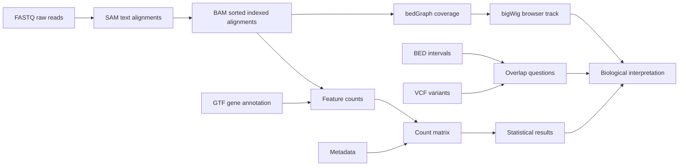

# The Bioinformatics File Types You Must Know

**Takeaway:** Bioinformatics files are not random extensions. Each file type tells you where you are in the journey from raw measurement to biological interpretation.

This guide has two layers:

- **Read first:** learn what each file means and what tools inspect it.
- **Do next:** run the mini lab at the end to convert alignments, make intervals, create a coverage track, and connect every file back to one biological question.

## Why File Types Matter

Many beginner mistakes happen before any statistics are run.

- opening huge files in the wrong program
- mixing genome builds
- losing the sample sheet
- using gene symbols when stable IDs are needed
- treating processed files as raw files
- forgetting that binary files need specialized tools

If you know what each file represents, the workflow becomes easier to debug. You can ask better questions:

```text
Is this raw data, aligned data, annotation, summarized counts, metadata, or a result?
```

That one question prevents a surprising number of mistakes.

## The Big Picture



The files change because the question changes:

```text
What was sequenced? -> Where did it align? -> What feature was counted? -> What changed?
```

The reusable file atlas, tiny data, environment file, and tutorial script are here: [`content/resources/week-03`](https://github.com/Caffeinated-Code/Bioinformatics-Field-Guide/tree/main/content/resources/week-03).

## The Tool Belt

You do not need to master every tool today. You do need to know which tool is safe for which file.

| Job | Tool | Why it matters |
|---|---|---|
| Inspect raw reads | FastQC, MultiQC, `seqkit`, `zcat` | Check quality before alignment or quantification |
| Work with SAM/BAM/CRAM | `samtools` | Convert, sort, index, slice, and summarize alignment files |
| Work with variants | `bcftools` | Inspect, filter, normalize, and query VCF files |
| Work with intervals | `bedtools` | Intersect BED, GTF, VCF, and BAM-derived regions |
| Make coverage tracks | `bedtools genomecov`, deepTools, UCSC tools | Turn alignments into browser-friendly signal |
| View genome tracks | IGV, UCSC Genome Browser | Sanity-check what the data look like in genomic context |
| Count features | featureCounts, HTSeq, Salmon, kallisto | Turn reads into gene or transcript-level tables |

If you remember only three commands for this week, remember:

```bash
samtools view file.bam | head
samtools index file.sorted.bam
bedtools intersect -a regions.bed -b annotation.gtf
```

## First Rule: Inspect, Do Not Open

Do not double-click a large bioinformatics file and hope your computer guesses correctly. Inspect from the terminal.

```bash
head file.tsv
less file.vcf
zcat reads.fastq.gz | head
samtools view alignments.bam | head
bcftools view variants.vcf.gz | head
```

Use file-aware tools when files are compressed, indexed, or binary. A spreadsheet is not a safe viewer for FASTQ, BAM, VCF, or large count matrices.

## FASTQ: Raw Sequencing Reads

FASTQ stores sequencing reads and quality scores. It is often the first file you receive after sequencing.

```text
@read_id
ACGTACGTACGT
+
FFFFFFFFFFFF
```

The sequence line contains bases. The quality line estimates confidence in each base call.

Use FASTQ to ask:

- Are the reads good enough?
- What is the read length?
- Are adapters present?
- Should reads be aligned or quantified?

Common tools: FastQC, MultiQC, fastp, cutadapt, STAR, HISAT2, Salmon, kallisto.

Do not edit FASTQ files by hand. If the file ends in `.fastq.gz`, keep it compressed unless a tool specifically requires otherwise.

## SAM And BAM: Where Reads Align

SAM is a text format for aligned sequencing reads. BAM is the compressed binary version. CRAM is an even more compressed format that depends on a reference genome. These files answer:

```text
Where did each read align?
```

Use alignment files to ask:

- Did reads align where expected?
- Is coverage high enough?
- Are there duplicate reads?
- Which reads overlap a gene, exon, peak, or variant?

BAM deserves extra attention because it sits in the middle of many genomics workflows. A BAM file is not just a table. It is a compressed alignment file that can store:

- read name
- chromosome or contig
- alignment start
- mapping quality
- CIGAR string
- strand and flags
- sequence and quality
- optional tags such as cell barcode, UMI, alignment score, or duplicate status

The CIGAR string is the compact description of how a read aligns. For example, `16M` means 16 aligned bases. Real files can contain soft clips, insertions, deletions, splicing, and split alignments.

BAM files are usually sorted and indexed:

```bash
samtools sort input.sam -o input.sorted.bam
samtools index input.sorted.bam
```

Sorting puts alignments in genomic order. Indexing creates a `.bai` file so tools can jump to `chr1:1000-2000` without scanning the whole BAM.

This distinction matters:

| File | Human-readable? | Random access? | Typical use |
|---|---:|---:|---|
| SAM | yes | no | debugging small examples |
| BAM | no | yes, with `.bai` | most alignment workflows |
| CRAM | no | yes, with index and reference | storage-efficient archival |

If a tool complains about a missing `.bai`, it is usually asking for the BAM index. If it complains about order, sort the BAM by coordinate before indexing.

Common tools: samtools, IGV, featureCounts, bedtools, GATK.

## VCF: Genetic Variants

VCF stores variants such as single nucleotide variants, insertions, deletions, and structural variants.

It usually includes:

- genomic position
- reference allele
- alternate allele
- quality information
- genotype information

Use VCF to ask:

- What variant was observed?
- In which sample or genotype?
- How strong is the evidence?
- Which variants pass filters?
- What annotation or clinical evidence supports interpretation?

The big caution: variant interpretation depends heavily on reference genome, annotation version, filtering logic, and clinical context.

## GTF And GFF: Genome Annotation

GTF and GFF files describe genomic features:

- genes
- transcripts
- exons
- coding regions
- other annotated elements

They help tools connect genomic coordinates to biological labels.

Use annotation files for:

- counting reads per gene
- transcript analysis
- feature overlap
- gene model interpretation

Always record which annotation version you used.

## BED: Genomic Intervals

BED files store genomic intervals. They are common in ATAC-seq, ChIP-seq, enhancer analysis, peak calling, and region overlap work.

```text
chr1    1000    1250    peak_1
chr1    3000    3400    peak_2
```

BED coordinates are usually **zero-based and half-open**:

```text
chr1  100  200
```

This means the interval starts at base 100 and ends before base 200. Its length is `200 - 100 = 100` bases.

Genome browser search boxes often use **one-based, fully closed** coordinates:

```text
chr1:101-200
```

These two examples describe the same span. The start changes because the coordinate systems count differently.

Save this rule:

| Format or display | Coordinate convention | Example span |
|---|---|---|
| BED | 0-start, half-open | `chr1 100 200` |
| bedGraph | 0-start, half-open | `chr1 100 200 7` |
| bigWig made from bedGraph | follows bedGraph-style intervals | browser signal track |
| VCF `POS` | 1-based position | `chr1 101` |
| GTF/GFF | 1-based, closed | `chr1 source exon 101 200 ...` |
| Browser search box | usually 1-based, closed | `chr1:101-200` |

That detail sounds tiny until an off-by-one error breaks an overlap analysis.

Use BED to ask:

- Which genomic regions are interesting?
- Which peaks overlap genes, promoters, enhancers, or variants?
- Which intervals are shared between experiments?

Common tools: bedtools, UCSC Genome Browser, IGV.

## bedGraph And bigWig: Signal Along The Genome

BED says, "this interval exists." bedGraph says, "this interval has this signal value."

```text
chr1    1000    1016    1
chr1    1200    1216    1
chr1    3000    3016    1
```

A bedGraph is text, easy to inspect, and useful for small examples. A bigWig is the indexed binary version designed for fast genome browser display. You usually create it in this direction:

```text
BAM -> bedGraph -> sorted bedGraph -> bigWig
```

Typical commands:

```bash
bedtools genomecov -ibam aligned.sorted.bam -bg > coverage.bedgraph
sort -k1,1 -k2,2n coverage.bedgraph > coverage.sorted.bedgraph
bedGraphToBigWig coverage.sorted.bedgraph chrom.sizes coverage.bw
```

Use bedGraph when you want to inspect or debug the signal. Use bigWig when you want to view or share a track in IGV or UCSC Genome Browser.

For RNA-seq, bigWig can show coverage across exons. For ATAC-seq or ChIP-seq, it can show open chromatin or protein-binding signal. For quality control, it helps answer a basic question: does the signal appear where biology says it should?

## Count Matrix: Where Many Analyses Begin

For RNA-seq and single-cell RNA-seq, statistical analysis often begins with a count matrix.

```text
gene_id    sample_1    sample_2    sample_3
GeneA      10          25          18
GeneB      0           4           1
GeneC      100         88          140
```

Rows are usually genes or features. Columns are samples or cells. Values are counts.

Counts without metadata are just numbers. Also check whether values are raw counts, TPM, CPM, normalized counts, log-transformed values, or scaled values. Many downstream methods expect one of these and fail quietly with another.

## Metadata: The File People Forget

Metadata describes samples:

```text
sample_id    condition    batch    tissue
S1           control      A        liver
S2           treated      A        liver
S3           control      B        liver
```

Metadata tells the analysis what the columns mean. It is where condition, batch, tissue, donor, time point, and covariates live.

If the metadata is wrong, the analysis will be wrong in a very quiet way.

At minimum, metadata should have:

- one stable sample ID column
- one row per biological sample or cell library
- condition or group labels
- batch or processing labels
- enough context to reproduce the comparison

## Save This: File Format Atlas

| File | Stage | Inspect with | Beginner warning |
|---|---|---|---|
| FASTQ / FASTQ.GZ | raw reads | `zcat`, `seqkit`, FastQC | do not edit by hand |
| SAM | aligned reads | `head`, `samtools view` | can be huge |
| BAM / CRAM | aligned reads | `samtools view`, IGV | sort and index before slicing regions |
| VCF / VCF.GZ | variants | `bcftools view`, `less` | interpretation depends on annotation |
| GTF/GFF | annotation | `head`, `awk`, `grep` | version matters |
| BED | genomic intervals | `head`, `bedtools` | coordinate conventions matter |
| bedGraph | interval signal | `head`, IGV | must be sorted before bigWig conversion |
| bigWig | indexed signal track | IGV, UCSC | binary; inspect with bigWig tools |
| count matrix | summarized features | R/Python, `head` | must match metadata |
| sample sheet | metadata | R/Python, SQL, `csvcut` | protect it like data |

## Hands-On Mini Lab: One Tiny Gene-Region Investigation

Goal: use every file type to answer one practical question:

```text
Do the toy reads, variants, intervals, annotations, coverage, counts, and metadata agree with each other?
```

The tiny examples are public-data-style practice files curated to mirror common records from public resources such as GENCODE, ClinVar/dbSNP-style VCFs, UCSC browser tracks, and SRA/ENA-style sequencing data. They are intentionally tiny and not meant for biological inference. Use the included `public_data_manifest.tsv` when you are ready to find real public examples of each file type.

### 1. Set Up The Week 3 Environment

From the repository root:

```bash
cd content/resources/week-03
conda env create -f environment.yml
conda activate bfg-week3-files
```

If you already have the tools, you can skip the environment and run the commands directly.

### 2. Inspect The Raw Pieces

```bash
head data/tiny_reads.fastq
samtools view -S data/tiny_alignments.sam
grep -v '^#' data/tiny_variants.vcf
awk '$3 == "exon"' data/tiny_annotation.gtf
cat data/tiny_regions.bed
cat data/tiny_counts.tsv
cat data/tiny_metadata.tsv
```

Ask what each file represents before asking what it means biologically.

### 3. Convert SAM To Sorted, Indexed BAM

```bash
mkdir -p results
samtools view -bS data/tiny_alignments.sam > results/tiny.bam
samtools sort results/tiny.bam -o results/tiny.sorted.bam
samtools index results/tiny.sorted.bam
samtools idxstats results/tiny.sorted.bam
```

You should now have:

```text
results/tiny.sorted.bam
results/tiny.sorted.bam.bai
```

This is the first moment where the file becomes browser-ready.

### 4. Ask An Interval Question With BED

Which reads overlap the two regions in `tiny_regions.bed`?

```bash
bedtools intersect \
  -a results/tiny.sorted.bam \
  -b data/tiny_regions.bed \
  -bed > results/reads_over_regions.bed

cat results/reads_over_regions.bed
```

This converts overlapping BAM alignments into BED-like output so you can inspect the interval logic.

### 5. Create bedGraph And bigWig Coverage

```bash
bedtools genomecov \
  -ibam results/tiny.sorted.bam \
  -bg > results/tiny.coverage.bedgraph

sort -k1,1 -k2,2n results/tiny.coverage.bedgraph > results/tiny.coverage.sorted.bedgraph
bedGraphToBigWig results/tiny.coverage.sorted.bedgraph data/tiny.chrom.sizes results/tiny.coverage.bw
```

Now you have both:

- `tiny.coverage.sorted.bedgraph`: text signal you can inspect
- `tiny.coverage.bw`: compact signal track for genome browsers

### 6. Connect Variants, Genes, Counts, And Metadata

```bash
bedtools intersect \
  -a data/tiny_regions.bed \
  -b data/tiny_annotation.gtf \
  -wa -wb > results/regions_overlapping_annotation.tsv

grep -v '^#' data/tiny_variants.vcf > results/variants.no_header.vcf
```

Then compare:

- Do the regions overlap the toy TP53-like and BRAF-like annotations?
- Do variants fall near the same places?
- Do the count matrix columns match the metadata sample IDs?
- Does the browser signal support what the table says?

### 7. Visualize In IGV

Open IGV, choose a matching genome or create a tiny custom genome if practicing locally, then load:

- `results/tiny.sorted.bam`
- `data/tiny_variants.vcf`
- `data/tiny_annotation.gtf`
- `data/tiny_regions.bed`
- `results/tiny.coverage.bw`

In real work, this visual check often catches problems that tables hide: wrong genome build, empty BAMs, mislabeled chromosomes, missing indexes, or signal in impossible places.

## Common Mistakes

- Opening huge files in spreadsheet software.
- Mixing genome builds.
- Forgetting BAM indexes.
- Forgetting Tabix indexes for compressed VCF or BED-like files.
- Confusing 0-based BED starts with 1-based VCF or GTF positions.
- Sharing a bedGraph when a collaborator needs a bigWig for browser performance.
- Loading BAM into IGV without keeping the `.bai` file next to it.
- Losing the sample sheet.
- Treating filtered files as raw files.
- Using gene symbols when stable IDs are needed.
- Sharing human genomic data without checking privacy rules.
- Running statistics on normalized values when the method expects raw counts.

## What To Watch Next

File formats are stable, but the way teams store, stream, validate, and document data is still evolving. Cloud-native workflows, metadata standards, and provenance tracking are becoming as important as the files themselves.

Next in the Foundation Series: turn these file instincts into a reproducible project structure so every input, output, script, notebook, and result has a predictable home.

## Credits and References

- SAM/BAM specification: https://samtools.github.io/hts-specs/SAMv1.pdf
- VCF specification: https://samtools.github.io/hts-specs/VCFv4.3.pdf
- Sequence Ontology GFF/GTF specifications: https://github.com/The-Sequence-Ontology/Specifications
- UCSC BED format FAQ: https://genome.ucsc.edu/FAQ/FAQformat.html
- UCSC bedGraph format: https://genome.ucsc.edu/goldenpath/help/bedgraph.html
- UCSC coordinate systems explainer: https://genome-blog.gi.ucsc.edu/blog/2016/12/12/the-ucsc-genome-browser-coordinate-counting-systems/
- FastQC: https://www.bioinformatics.babraham.ac.uk/projects/fastqc/
- MultiQC: https://multiqc.info/
- bedtools: https://bedtools.readthedocs.io/
- samtools: https://www.htslib.org/doc/samtools.html
- bcftools: https://samtools.github.io/bcftools/
- IGV: https://igv.org/
- UCSC Genome Browser: https://genome.ucsc.edu/
- ENCODE Portal: https://www.encodeproject.org/
- GENCODE: https://www.gencodegenes.org/
- ClinVar: https://www.ncbi.nlm.nih.gov/clinvar/
- NCBI SRA: https://www.ncbi.nlm.nih.gov/sra
- Bioconductor RNA-seq workflow: https://www.bioconductor.org/packages/release/workflows/vignettes/rnaseqGene/inst/doc/rnaseqGene.html
