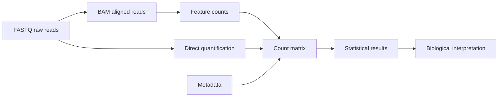

# The Bioinformatics File Types You Must Know

**Takeaway:** Bioinformatics files are not random extensions. Each file type tells you where you are in the journey from raw measurement to biological interpretation.

## Why File Types Matter

Many beginner mistakes happen before any statistics are run.

- opening huge files in the wrong program
- mixing genome builds
- losing the sample sheet
- using gene symbols when stable IDs are needed
- treating processed files as raw files
- forgetting that binary files need specialized tools

If you know what each file represents, the workflow becomes easier to debug. You can ask better questions:

```text
Is this raw data, aligned data, annotation, summarized counts, metadata, or a result?
```

That one question prevents a surprising number of mistakes.

## The Big Picture



The files change because the question changes:

```text
What was sequenced? -> Where did it align? -> What feature was counted? -> What changed?
```

The reusable file atlas and tiny example files are here: [`content/resources/week-03`](https://github.com/Caffeinated-Code/Bioinformatics-Field-Guide/tree/main/content/resources/week-03).

## First Rule: Inspect, Do Not Open

Do not double-click a large bioinformatics file and hope your computer guesses correctly. Inspect from the terminal.

```bash
head file.tsv
less file.vcf
zcat reads.fastq.gz | head
samtools view alignments.bam | head
bcftools view variants.vcf.gz | head
```

Use file-aware tools when files are compressed, indexed, or binary. A spreadsheet is not a safe viewer for FASTQ, BAM, VCF, or large count matrices.

## FASTQ: Raw Sequencing Reads

FASTQ stores sequencing reads and quality scores. It is often the first file you receive after sequencing.

```text
@read_id
ACGTACGTACGT
+
FFFFFFFFFFFF
```

The sequence line contains bases. The quality line estimates confidence in each base call.

Use FASTQ to ask:

- Are the reads good enough?
- What is the read length?
- Are adapters present?
- Should reads be aligned or quantified?

Common tools: FastQC, MultiQC, fastp, cutadapt, STAR, HISAT2, Salmon, kallisto.

Do not edit FASTQ files by hand. If the file ends in `.fastq.gz`, keep it compressed unless a tool specifically requires otherwise.

## SAM And BAM: Where Reads Align

SAM is a text format for aligned sequencing reads. BAM is the compressed binary version. CRAM is an even more compressed format that depends on a reference genome. These files answer:

```text
Where did each read align?
```

Use alignment files to ask:

- Did reads align where expected?
- Is coverage high enough?
- Are there duplicate reads?
- Which reads overlap a gene, exon, peak, or variant?

BAM files are usually indexed. If a tool complains about a missing `.bai` file, it is asking for the BAM index.

Common tools: samtools, IGV, featureCounts, bedtools, GATK.

## VCF: Genetic Variants

VCF stores variants such as single nucleotide variants, insertions, deletions, and structural variants.

It usually includes:

- genomic position
- reference allele
- alternate allele
- quality information
- genotype information

Use VCF to ask:

- What variant was observed?
- In which sample or genotype?
- How strong is the evidence?
- Which variants pass filters?
- What annotation or clinical evidence supports interpretation?

The big caution: variant interpretation depends heavily on reference genome, annotation version, filtering logic, and clinical context.

## GTF And GFF: Genome Annotation

GTF and GFF files describe genomic features:

- genes
- transcripts
- exons
- coding regions
- other annotated elements

They help tools connect genomic coordinates to biological labels.

Use annotation files for:

- counting reads per gene
- transcript analysis
- feature overlap
- gene model interpretation

Always record which annotation version you used.

## BED: Genomic Intervals

BED files store genomic intervals. They are common in ATAC-seq, ChIP-seq, enhancer analysis, peak calling, and region overlap work.

```text
chr1    1000    1250    peak_1
chr1    3000    3400    peak_2
```

BED coordinates are usually zero-based and half-open. That detail sounds tiny until an off-by-one error breaks an overlap analysis.

Use BED to ask:

- Which genomic regions are interesting?
- Which peaks overlap genes, promoters, enhancers, or variants?
- Which intervals are shared between experiments?

Common tools: bedtools, UCSC Genome Browser, IGV.

## Count Matrix: Where Many Analyses Begin

For RNA-seq and single-cell RNA-seq, statistical analysis often begins with a count matrix.

```text
gene_id    sample_1    sample_2    sample_3
GeneA      10          25          18
GeneB      0           4           1
GeneC      100         88          140
```

Rows are usually genes or features. Columns are samples or cells. Values are counts.

Counts without metadata are just numbers. Also check whether values are raw counts, TPM, CPM, normalized counts, log-transformed values, or scaled values. Many downstream methods expect one of these and fail quietly with another.

## Metadata: The File People Forget

Metadata describes samples:

```text
sample_id    condition    batch    tissue
S1           control      A        liver
S2           treated      A        liver
S3           control      B        liver
```

Metadata tells the analysis what the columns mean. It is where condition, batch, tissue, donor, time point, and covariates live.

If the metadata is wrong, the analysis will be wrong in a very quiet way.

At minimum, metadata should have:

- one stable sample ID column
- one row per biological sample or cell library
- condition or group labels
- batch or processing labels
- enough context to reproduce the comparison

## Save This: File Format Atlas

| File | Stage | Inspect with | Beginner warning |
|---|---|---|---|
| FASTQ / FASTQ.GZ | raw reads | `zcat`, `seqkit`, FastQC | do not edit by hand |
| SAM | aligned reads | `head`, `samtools view` | can be huge |
| BAM / CRAM | aligned reads | `samtools view`, IGV | usually needs an index |
| VCF / VCF.GZ | variants | `bcftools view`, `less` | interpretation depends on annotation |
| GTF/GFF | annotation | `head`, `awk`, `grep` | version matters |
| BED | genomic intervals | `head`, `bedtools` | coordinate conventions matter |
| count matrix | summarized features | R/Python, `head` | must match metadata |
| sample sheet | metadata | R/Python, SQL, `csvcut` | protect it like data |

## Common Mistakes

- Opening huge files in spreadsheet software.
- Mixing genome builds.
- Forgetting BAM indexes.
- Forgetting Tabix indexes for compressed VCF or BED-like files.
- Losing the sample sheet.
- Treating filtered files as raw files.
- Using gene symbols when stable IDs are needed.
- Sharing human genomic data without checking privacy rules.
- Running statistics on normalized values when the method expects raw counts.

## What To Watch Next

File formats are stable, but the way teams store, stream, validate, and document data is still evolving. Cloud-native workflows, metadata standards, and provenance tracking are becoming as important as the files themselves.

Next in the Foundation Series: turn these file instincts into a reproducible project structure so every input, output, script, notebook, and result has a predictable home.

## Credits and References

- SAM/BAM specification: https://samtools.github.io/hts-specs/SAMv1.pdf
- VCF specification: https://samtools.github.io/hts-specs/VCFv4.3.pdf
- Sequence Ontology GFF/GTF specifications: https://github.com/The-Sequence-Ontology/Specifications
- UCSC BED format FAQ: https://genome.ucsc.edu/FAQ/FAQformat.html
- FastQC: https://www.bioinformatics.babraham.ac.uk/projects/fastqc/
- MultiQC: https://multiqc.info/
- bedtools: https://bedtools.readthedocs.io/
- samtools: https://www.htslib.org/doc/samtools.html
- bcftools: https://samtools.github.io/bcftools/
- Bioconductor RNA-seq workflow: https://www.bioconductor.org/packages/release/workflows/vignettes/rnaseqGene/inst/doc/rnaseqGene.html
