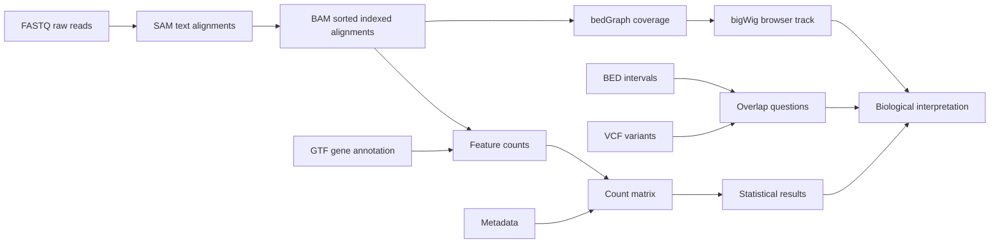

# The Bioinformatics File Types You Must Know

**Takeaway:** Bioinformatics files are not random extensions. Each file type tells you where you are in the journey from raw measurement to biological interpretation.

This guide has two layers:

- **Read first:** learn what each file means and what tools inspect it.
- **Do next:** run the mini lab at the end to convert alignments, make intervals, create a coverage track, and connect every file back to one biological question.

## Why File Types Matter

Many beginner mistakes happen before any statistics are run.

- opening huge files in the wrong program
- mixing genome builds
- losing the sample sheet
- using gene symbols when stable IDs are needed
- treating processed files as raw files
- forgetting that binary files need specialized tools

If you know what each file represents, the workflow becomes easier to debug. You can ask better questions:

```text
Is this raw data, aligned data, annotation, summarized counts, metadata, or a result?
```

That one question prevents a surprising number of mistakes.

## The Big Picture



The files change because the question changes:

```text
What was sequenced? -> Where did it align? -> What feature was counted? -> What changed?
```

The reusable file atlas, tiny data, environment file, and tutorial script are here: [`content/resources/week-03`](https://github.com/Caffeinated-Code/Bioinformatics-Field-Guide/tree/main/content/resources/week-03).

## The Tool Belt

You do not need to master every tool today. You do need to know which tool is safe for which file.

| Job | Tool | Why it matters |
|---|---|---|
| Inspect raw reads | FastQC, MultiQC, `seqkit`, `gzip -cd` | Check quality before alignment or quantification |
| Work with SAM/BAM/CRAM | `samtools` | Convert, sort, index, slice, and summarize alignment files |
| Work with variants | `bcftools` | Inspect, filter, normalize, and query VCF files |
| Work with intervals | `bedtools` | Intersect BED, GTF, VCF, and BAM-derived regions |
| Make coverage tracks | `bedtools genomecov`, deepTools, UCSC tools | Turn alignments into browser-friendly signal |
| View genome tracks | IGV, UCSC Genome Browser | Sanity-check what the data look like in genomic context |
| Count features | featureCounts, HTSeq, Salmon, kallisto | Turn reads into gene or transcript-level tables |

If you remember only three commands for this week, remember:

```bash
samtools view file.bam | head
samtools index file.sorted.bam
bedtools intersect -a regions.bed -b annotation.gtf
```

## First Rule: Inspect, Do Not Open

Do not double-click a large bioinformatics file and hope your computer guesses correctly. Inspect from the terminal.

```bash
head file.tsv
less file.vcf
gzip -cd reads.fastq.gz | head
samtools view alignments.bam | head
bcftools view variants.vcf.gz | head
```

Use file-aware tools when files are compressed, indexed, or binary. A spreadsheet is not a safe viewer for FASTQ, BAM, VCF, or large count matrices.

Before interpreting any public file, inspect it from the outside in:

```bash
ls -lh file
wc -l file
head file
file file
```

For compressed files:

```bash
ls -lh file.gz
gzip -t file.gz
gzip -cd file.gz | head
gzip -cd file.gz | wc -l
```

For indexed binary files:

```bash
samtools quickcheck file.bam
samtools view -H file.bam | head
samtools flagstat file.bam
```

This habit answers four questions before biology enters the room:

- Did the download finish?
- Is the file compressed, text, or binary?
- Does the size look plausible?
- Do the first few records match the format I think I downloaded?

## FASTQ: Raw Sequencing Reads

FASTQ stores sequencing reads and quality scores. It is often the first file you receive after sequencing.

For a real public example, the optional resource script downloads a small paired-end FASTQ file from ENA for SRA run `SRR1553607`:

```bash
cd content/resources/week-03
bash public_file_drill.sh
```

The FASTQ part of that script does three checks:

```bash
ls -lh public_examples/SRR1553607_1.fastq.gz
gzip -t public_examples/SRR1553607_1.fastq.gz
gzip -cd public_examples/SRR1553607_1.fastq.gz | head -8
gzip -cd public_examples/SRR1553607_1.fastq.gz | awk 'END {print NR " lines; " NR/4 " reads"}'
```

FASTQ records come in groups of four lines:

```text
@read_id
ACGTACGTACGT
+
FFFFFFFFFFFF
```

| Line | Meaning |
|---|---|
| 1 | Read identifier. It starts with `@`. |
| 2 | DNA or RNA sequence. |
| 3 | Separator. It starts with `+` and may repeat the identifier. |
| 4 | Quality string. It must be the same length as the sequence. |

The sequence line contains bases. The quality line encodes confidence in each base call. A valid FASTQ should have a line count divisible by four.

Use FASTQ to ask:

- Are the reads good enough?
- What is the read length?
- Are adapters present?
- Should reads be aligned or quantified?

Common tools: FastQC, MultiQC, `seqkit`, fastp, cutadapt, STAR, HISAT2, Salmon, kallisto.

Do not edit FASTQ files by hand. If the file ends in `.fastq.gz`, keep it compressed unless a tool specifically requires otherwise.

## SAM And BAM: Where Reads Align

SAM is a text format for aligned sequencing reads. BAM is the compressed binary version. CRAM is an even more compressed format that depends on a reference genome. These files answer:

```text
Where did each read align?
```

For public format practice, the optional drill downloads UCSC example files:

```bash
curl -L -o public_examples/ucsc.samExample.sam \
  https://genome.ucsc.edu/goldenPath/help/examples/samExample.sam

curl -L -o public_examples/ucsc.bamExample.bam \
  https://genome.ucsc.edu/goldenPath/help/examples/bamExample.bam

curl -L -o public_examples/ucsc.cramExample.cram \
  https://genome.ucsc.edu/goldenPath/help/examples/cramExample.cram
```

Inspect SAM as text:

```bash
wc -l public_examples/ucsc.samExample.sam
head -5 public_examples/ucsc.samExample.sam
```

Inspect BAM as binary alignment data:

```bash
samtools quickcheck -v public_examples/ucsc.bamExample.bam
samtools view -H public_examples/ucsc.bamExample.bam | head
samtools flagstat public_examples/ucsc.bamExample.bam
samtools view public_examples/ucsc.bamExample.bam | head
```

Use alignment files to ask:

- Did reads align where expected?
- Is coverage high enough?
- Are there duplicate reads?
- Which reads overlap a gene, exon, peak, or variant?

BAM deserves extra attention because it sits in the middle of many genomics workflows. A BAM file is not just a table. It is a compressed alignment file that can store:

- read name
- chromosome or contig
- alignment start
- mapping quality
- CIGAR string
- strand and flags
- sequence and quality
- optional tags such as cell barcode, UMI, alignment score, or duplicate status

The core SAM alignment columns are:

| Column | Name | Meaning |
|---:|---|---|
| 1 | QNAME | Read name |
| 2 | FLAG | Bitwise alignment summary |
| 3 | RNAME | Reference sequence or chromosome |
| 4 | POS | 1-based leftmost alignment position |
| 5 | MAPQ | Mapping quality |
| 6 | CIGAR | How the read aligns |
| 7 | RNEXT | Mate reference name |
| 8 | PNEXT | Mate position |
| 9 | TLEN | Template length |
| 10 | SEQ | Read sequence |
| 11 | QUAL | Base qualities |
| 12+ | Tags | Optional extra fields |

The CIGAR string is the compact description of how a read aligns. For example, `16M` means 16 aligned bases. Real files can contain soft clips, insertions, deletions, splicing, and split alignments.

BAM files are usually sorted and indexed:

```bash
samtools sort input.sam -o input.sorted.bam
samtools index input.sorted.bam
```

Sorting puts alignments in genomic order. Indexing creates a `.bai` file so tools can jump to `chr1:1000-2000` without scanning the whole BAM.

This distinction matters:

| File | Human-readable? | Random access? | Typical use |
|---|---:|---:|---|
| SAM | yes | no | debugging small examples |
| BAM | no | yes, with `.bai` | most alignment workflows |
| CRAM | no | yes, with index and reference | storage-efficient archival |

If a tool complains about a missing `.bai`, it is usually asking for the BAM index. If it complains about order, sort the BAM by coordinate before indexing.

Common tools: samtools, IGV, featureCounts, bedtools, GATK.

### SAM Flags: Tiny Numbers With A Lot Of Meaning

The SAM `FLAG` column is a bitwise code. It compresses many yes/no alignment properties into one integer.

Common flags:

| Flag | Meaning |
|---:|---|
| 1 | read is paired |
| 2 | read is properly paired |
| 4 | read is unmapped |
| 8 | mate is unmapped |
| 16 | read maps to reverse strand |
| 32 | mate maps to reverse strand |
| 64 | first read in pair |
| 128 | second read in pair |
| 256 | secondary alignment |
| 512 | failed vendor/platform QC |
| 1024 | PCR or optical duplicate |
| 2048 | supplementary alignment |

Use `samtools flags` to decode a number:

```bash
samtools flags 4
samtools flags 16
samtools flags 260
```

Use `-f` to keep reads where a flag is present:

```bash
samtools view -c -f 4 aligned.bam
```

That counts unmapped reads.

Use `-F` to remove reads where a flag is present:

```bash
samtools view -c -F 4 aligned.bam
```

That counts reads that are not marked unmapped. A common beginner-friendly filter is:

```bash
samtools view -b -F 260 aligned.bam > primary_mapped.bam
```

`260` combines `4` and `256`, so this removes unmapped and secondary alignments. In serious analyses, write down exactly which flags you filtered and why.

## VCF: Genetic Variants

VCF stores variants such as single nucleotide variants, insertions, deletions, and structural variants.

For a public example:

```bash
curl -L -o public_examples/ucsc.vcfExample.vcf.gz \
  https://genome.ucsc.edu/goldenPath/help/examples/vcfExample.vcf.gz

bcftools view -h public_examples/ucsc.vcfExample.vcf.gz | grep '^##' | head
bcftools view -h public_examples/ucsc.vcfExample.vcf.gz | grep '^#CHROM' | cut -f1-10
bcftools view -H public_examples/ucsc.vcfExample.vcf.gz | cut -f1-10 | head
```

It usually includes:

- genomic position
- reference allele
- alternate allele
- quality information
- genotype information

The required VCF columns are:

| Column | Meaning |
|---|---|
| `CHROM` | Chromosome or contig |
| `POS` | 1-based variant position |
| `ID` | Variant identifier, if known |
| `REF` | Reference allele |
| `ALT` | Alternate allele |
| `QUAL` | Variant quality score |
| `FILTER` | Whether the variant passed filters |
| `INFO` | Semicolon-separated annotations |
| `FORMAT` | Genotype fields used by sample columns |
| sample columns | Genotypes and sample-level values |

Use VCF to ask:

- What variant was observed?
- In which sample or genotype?
- How strong is the evidence?
- Which variants pass filters?
- What annotation or clinical evidence supports interpretation?

The big caution: variant interpretation depends heavily on reference genome, annotation version, filtering logic, and clinical context.

## GTF And GFF: Genome Annotation

GTF and GFF files describe genomic features:

- genes
- transcripts
- exons
- coding regions
- other annotated elements

They help tools connect genomic coordinates to biological labels.

For small format practice, the public drill downloads a UCSC GTF example. For real annotation, use GENCODE, Ensembl, or RefSeq and pay attention to release number and genome build.

```bash
curl -L -o public_examples/ucsc.bigGenePredExample4.gtf \
  https://genome.ucsc.edu/goldenPath/help/examples/bigGenePredExample4.gtf

wc -l public_examples/ucsc.bigGenePredExample4.gtf
head -5 public_examples/ucsc.bigGenePredExample4.gtf
```

GTF has nine columns:

| Column | Meaning |
|---:|---|
| 1 | sequence name |
| 2 | source |
| 3 | feature type, such as gene, transcript, exon |
| 4 | start, 1-based |
| 5 | end, 1-based and closed |
| 6 | score |
| 7 | strand |
| 8 | frame |
| 9 | attributes, such as `gene_id` and `transcript_id` |

GFF3 is similar, but its attribute column uses `key=value` style and the file usually starts with `##gff-version 3`.

To stream the first records from a real GENCODE GFF3 without keeping the full file:

```bash
curl -L https://ftp.ebi.ac.uk/pub/databases/gencode/Gencode_human/release_50/gencode.v50.basic.annotation.gff3.gz \
  | gzip -cd \
  | head
```

Use annotation files for:

- counting reads per gene
- transcript analysis
- feature overlap
- gene model interpretation

Always record which annotation version you used.

## BED: Genomic Intervals

BED files store genomic intervals. They are common in ATAC-seq, ChIP-seq, enhancer analysis, peak calling, and region overlap work.

For a public example:

```bash
curl -L -o public_examples/ucsc.bedExample2.bed \
  https://genome.ucsc.edu/goldenPath/help/examples/bedExample2.bed

wc -l public_examples/ucsc.bedExample2.bed
head -5 public_examples/ucsc.bedExample2.bed
```

```text
chr1    1000    1250    peak_1
chr1    3000    3400    peak_2
```

The first three BED columns are required:

| Column | Meaning |
|---:|---|
| 1 | chromosome |
| 2 | start, 0-based |
| 3 | end, half-open |

Common optional columns include name, score, strand, thickStart, thickEnd, itemRgb, blockCount, blockSizes, and blockStarts.

BED coordinates are usually **zero-based and half-open**:

```text
chr1  100  200
```

This means the interval starts at base 100 and ends before base 200. Its length is `200 - 100 = 100` bases.

Genome browser search boxes often use **one-based, fully closed** coordinates:

```text
chr1:101-200
```

These two examples describe the same span. The start changes because the coordinate systems count differently.

Save this rule:

| Format or display | Coordinate convention | Example span |
|---|---|---|
| BED | 0-start, half-open | `chr1 100 200` |
| bedGraph | 0-start, half-open | `chr1 100 200 7` |
| bigWig made from bedGraph | follows bedGraph-style intervals | browser signal track |
| VCF `POS` | 1-based position | `chr1 101` |
| GTF/GFF | 1-based, closed | `chr1 source exon 101 200 ...` |
| Browser search box | usually 1-based, closed | `chr1:101-200` |

That detail sounds tiny until an off-by-one error breaks an overlap analysis.

Use BED to ask:

- Which genomic regions are interesting?
- Which peaks overlap genes, promoters, enhancers, or variants?
- Which intervals are shared between experiments?

Common tools: bedtools, UCSC Genome Browser, IGV.

## bedGraph And bigWig: Signal Along The Genome

BED says, "this interval exists." bedGraph says, "this interval has this signal value."

```text
chr1    1000    1016    1
chr1    1200    1216    1
chr1    3000    3016    1
```

A bedGraph is text, easy to inspect, and useful for small examples. A bigWig is the indexed binary version designed for fast genome browser display. You usually create it in this direction:

```text
BAM -> bedGraph -> sorted bedGraph -> bigWig
```

Typical commands:

```bash
bedtools genomecov -ibam aligned.sorted.bam -bg > coverage.bedgraph
sort -k1,1 -k2,2n coverage.bedgraph > coverage.sorted.bedgraph
bedGraphToBigWig coverage.sorted.bedgraph chrom.sizes coverage.bw
```

Use bedGraph when you want to inspect or debug the signal. Use bigWig when you want to view or share a track in IGV or UCSC Genome Browser.

bedGraph has four required columns:

| Column | Meaning |
|---:|---|
| 1 | chromosome |
| 2 | start, 0-based |
| 3 | end, half-open |
| 4 | signal value |

For a public bigWig example:

```bash
curl -L -o public_examples/ucsc.bigWigExample2.bw \
  https://genome.ucsc.edu/goldenPath/help/examples/bigWigExample2.bw

ls -lh public_examples/ucsc.bigWigExample2.bw
bigWigInfo public_examples/ucsc.bigWigExample2.bw
```

You cannot safely `head` a bigWig because it is binary. Use `bigWigInfo`, `bigWigSummary`, IGV, or UCSC Genome Browser.

For RNA-seq, bigWig can show coverage across exons. For ATAC-seq or ChIP-seq, it can show open chromatin or protein-binding signal. For quality control, it helps answer a basic question: does the signal appear where biology says it should?

## Count Matrix: Where Many Analyses Begin

For RNA-seq and single-cell RNA-seq, statistical analysis often begins with a count matrix.

```text
gene_id    sample_1    sample_2    sample_3
GeneA      10          25          18
GeneB      0           4           1
GeneC      100         88          140
```

Rows are usually genes or features. Columns are samples or cells. Values are counts.

Counts without metadata are just numbers. Also check whether values are raw counts, TPM, CPM, normalized counts, log-transformed values, or scaled values. Many downstream methods expect one of these and fail quietly with another.

Inspect the tiny example:

```bash
wc -l data/tiny_counts.tsv
head data/tiny_counts.tsv
```

The first column is the feature ID. Every other column should match a sample or cell ID in metadata.

## Metadata: The File People Forget

Metadata describes samples:

```text
sample_id    condition    batch    tissue
S1           control      A        liver
S2           treated      A        liver
S3           control      B        liver
```

Metadata tells the analysis what the columns mean. It is where condition, batch, tissue, donor, time point, and covariates live.

If the metadata is wrong, the analysis will be wrong in a very quiet way.

At minimum, metadata should have:

- one stable sample ID column
- one row per biological sample or cell library
- condition or group labels
- batch or processing labels
- enough context to reproduce the comparison

Inspect the tiny example:

```bash
wc -l data/tiny_metadata.tsv
head data/tiny_metadata.tsv
```

The key test is whether every count-matrix sample column has exactly one matching metadata row.

## Save This: File Format Atlas

| File | Stage | Inspect with | Beginner warning |
|---|---|---|---|
| FASTQ / FASTQ.GZ | raw reads | `gzip -cd`, `seqkit`, FastQC | do not edit by hand |
| SAM | aligned reads | `head`, `samtools view` | can be huge |
| BAM / CRAM | aligned reads | `samtools view`, IGV | sort and index before slicing regions |
| VCF / VCF.GZ | variants | `bcftools view`, `less` | interpretation depends on annotation |
| GTF/GFF | annotation | `head`, `awk`, `grep` | version matters |
| BED | genomic intervals | `head`, `bedtools` | coordinate conventions matter |
| bedGraph | interval signal | `head`, IGV | must be sorted before bigWig conversion |
| bigWig | indexed signal track | IGV, UCSC | binary; inspect with bigWig tools |
| count matrix | summarized features | R/Python, `head` | must match metadata |
| sample sheet | metadata | R/Python, SQL, `csvcut` | protect it like data |

## Optional Public Download Drill

When you are ready to touch real public files, run:

```bash
# Move into the Week 3 resource folder.
cd content/resources/week-03

# Activate the environment from Week 3.
conda activate bfg-week3-files

# Download small public examples and inspect each format.
bash public_file_drill.sh
```

This creates a local `public_examples/` folder and downloads small public examples from ENA/SRA and UCSC. It does not commit those files to Git. The goal is not biological analysis yet. The goal is to learn how to verify a file before trusting it.

The drill checks:

| File type | Public source used | What the script checks |
|---|---|---|
| FASTQ | ENA mirror of SRA run `SRR1553607` | size, gzip integrity, first two records, line count, read count |
| SAM | UCSC example file | size, line count, header, first records |
| BAM | UCSC example BAM + BAI | binary validity, header, alignment summary, first records |
| CRAM | UCSC example CRAM + CRAI | file presence, index presence, quick validity |
| VCF | UCSC compressed VCF + Tabix index | header and first variant records |
| BED | UCSC BED example | line count and first intervals |
| GTF | UCSC GTF example | line count, first records, feature columns |
| bigWig | UCSC bigWig example | binary track metadata with `bigWigInfo` |

Use this pattern for any public database:

```bash
# Keep downloaded public files separate from your teaching files.
mkdir -p public_examples

# Download with -L to follow redirects and --fail to stop on HTTP errors.
curl -L --fail -o public_examples/file.ext URL

# Check whether the file exists and whether the size looks plausible.
ls -lh public_examples/file.ext

# For plain text files only, preview the first few lines.
head public_examples/file.ext
```

For compressed or binary files, swap `head` for the correct tool:

```bash
# Test gzip integrity. No output usually means success.
gzip -t reads.fastq.gz

# Stream the first few decompressed lines without creating a new file.
gzip -cd reads.fastq.gz | head

# Check whether a BAM file is structurally valid.
samtools quickcheck alignments.bam

# Preview VCF metadata/header lines.
bcftools view -h variants.vcf.gz | head

# Inspect binary bigWig metadata.
bigWigInfo signal.bw
```

Expected public-drill checkpoints look like this:

```text
public_examples/SRR1553607_1.fastq.gz       15708027 bytes
public_examples/ucsc.bamExample.bam          2281952 bytes
public_examples/ucsc.vcfExample.vcf.gz         44389 bytes
```

For the BAM flag section, you should see counts like:

```text
0x4  4  UNMAP
631
35511
35511
```

Read that as: flag `4` means unmapped; this public BAM has 631 unmapped reads, 35,511 reads that are not marked unmapped, and 35,511 reads left after removing unmapped plus secondary alignments.

## Hands-On Mini Lab: One Tiny Gene-Region Investigation

Goal: use every file type to answer one practical question:

```text
Do the toy reads, variants, intervals, annotations, coverage, counts, and metadata agree with each other?
```

The tiny examples are public-data-style practice files curated to mirror common records from public resources such as GENCODE, ClinVar/dbSNP-style VCFs, UCSC browser tracks, and SRA/ENA-style sequencing data. They are intentionally tiny and not meant for biological inference. Use the included `public_data_manifest.tsv` when you are ready to find real public examples of each file type.

### 1. Set Up The Week 3 Environment

From the repository root:

```bash
# Move into the Week 3 resource folder.
cd content/resources/week-03

# Create the environment once. Skip this if you already created it.
conda env create -f environment.yml

# Activate the environment before running the lab.
conda activate bfg-week3-files
```

If you already have the tools, you can skip the environment and run the commands directly.

### 2. Inspect The Raw Pieces

```bash
# Show the first two FASTQ records.
head -8 data/tiny_reads.fastq

# Count FASTQ lines and reads. FASTQ records come in 4-line blocks.
awk 'END {print NR " lines; " NR/4 " reads"}' data/tiny_reads.fastq

# Inspect text SAM alignments.
samtools view -S data/tiny_alignments.sam

# Show VCF variant rows without metadata/header lines.
grep -v '^#' data/tiny_variants.vcf

# Show only exon records from the GTF annotation.
awk '$3 == "exon"' data/tiny_annotation.gtf

# Inspect interval, count, and metadata tables.
cat data/tiny_regions.bed
cat data/tiny_counts.tsv
cat data/tiny_metadata.tsv
```

Ask what each file represents before asking what it means biologically.

Expected FASTQ checkpoint:

```text
@S1_read_001
ACGTACGTACGTACGT
+
FFFFFFFFFFFFFFFF
@S1_read_002
TGCATGCATGCATGCA
+
FFFFFFFFFFFFFFFA
12 lines; 3 reads
```

### 3. Convert SAM To Sorted, Indexed BAM

```bash
# Keep generated outputs in one folder.
mkdir -p results

# Convert text SAM to compressed binary BAM.
samtools view -bS data/tiny_alignments.sam > results/tiny.bam

# Sort BAM by genomic coordinate.
samtools sort results/tiny.bam -o results/tiny.sorted.bam

# Create a BAM index: results/tiny.sorted.bam.bai.
samtools index results/tiny.sorted.bam

# Count alignments by contig.
samtools idxstats results/tiny.sorted.bam

# Summarize mapped/unmapped and other SAM flag categories.
samtools flagstat results/tiny.sorted.bam
```

You should now have:

```text
results/tiny.sorted.bam
results/tiny.sorted.bam.bai
```

This is the first moment where the file becomes browser-ready.

Expected BAM checkpoint:

```text
chr1    10000    3    0
*       0        0    0
3 + 0 in total (QC-passed reads + QC-failed reads)
3 + 0 primary
0 + 0 secondary
0 + 0 supplementary
3 + 0 mapped (100.00% : N/A)
```

### 4. Filter BAM Records With SAM Flags

Decode the unmapped flag:

```bash
# Decode SAM flag 4. It means the read is unmapped.
samtools flags 4
```

Count unmapped reads:

```bash
# -f keeps reads where this flag is present.
samtools view -c -f 4 results/tiny.sorted.bam
```

Count mapped reads by excluding the unmapped flag:

```bash
# -F removes reads where this flag is present.
samtools view -c -F 4 results/tiny.sorted.bam
```

Write only mapped alignments to a SAM-like text file:

```bash
# Write mapped reads to a text file for inspection.
samtools view -F 4 results/tiny.sorted.bam > results/mapped_reads.sam
```

In this tiny example, all three reads are mapped. In real public BAMs, flag filtering is one of the first ways to separate primary, secondary, supplementary, duplicate, mapped, and unmapped records.

Expected flag checkpoint:

```text
0x4    4    UNMAP
unmapped reads: 0
mapped reads: 3
```

### 5. Ask An Interval Question With BED

Which reads overlap the two regions in `tiny_regions.bed`?

```bash
# Find BAM alignments that overlap the intervals in tiny_regions.bed.
# The -bed option prints BED-like text output instead of binary BAM.
bedtools intersect \
  -a results/tiny.sorted.bam \
  -b data/tiny_regions.bed \
  -bed > results/reads_over_regions.bed

# Inspect the overlapping read intervals.
cat results/reads_over_regions.bed
```

This converts overlapping BAM alignments into BED-like output so you can inspect the interval logic.

Expected overlap checkpoint:

```text
chr1    1000    1016    S1_read_001    60    +
chr1    3000    3016    S2_read_001    35    -
```

### 6. Create bedGraph And bigWig Coverage

```bash
# Convert BAM alignments into bedGraph coverage intervals.
bedtools genomecov \
  -ibam results/tiny.sorted.bam \
  -bg > results/tiny.coverage.bedgraph

# Sort bedGraph before bigWig conversion.
sort -k1,1 -k2,2n results/tiny.coverage.bedgraph > results/tiny.coverage.sorted.bedgraph

# Convert text bedGraph signal to indexed binary bigWig signal.
bedGraphToBigWig results/tiny.coverage.sorted.bedgraph data/tiny.chrom.sizes results/tiny.coverage.bw
```

Now you have both:

- `tiny.coverage.sorted.bedgraph`: text signal you can inspect
- `tiny.coverage.bw`: compact signal track for genome browsers

Expected coverage checkpoint:

```text
chr1    1000    1016    1
chr1    1200    1216    1
chr1    3000    3016    1
```

### 7. Connect Variants, Genes, Counts, And Metadata

```bash
# Join BED regions to overlapping GTF annotation records.
bedtools intersect \
  -a data/tiny_regions.bed \
  -b data/tiny_annotation.gtf \
  -wa -wb > results/regions_overlapping_annotation.tsv

# Remove VCF header lines so only variant rows remain.
grep -v '^#' data/tiny_variants.vcf > results/variants.no_header.vcf
```

Then compare:

- Do the regions overlap the toy TP53-like and BRAF-like annotations?
- Do variants fall near the same places?
- Do the count matrix columns match the metadata sample IDs?
- Does the browser signal support what the table says?

Expected annotation and VCF checkpoints:

```text
chr1  950   1150  promoter_like_region  chr1  tiny  gene  900   1500  ... gene_name "TP53";
chr1  2950  3250  peak_like_region      chr1  tiny  gene  2800  3400  ... gene_name "BRAF";
```

```text
chr1    1050    rsTiny1    A    G    99    PASS    GENE=TP53    GT    0/1    0/0
chr1    3050    .          C    T    42    q10     GENE=BRAF    GT    0/0    0/1
```

### 8. Run The Whole Lab Script

If you want the guided version with comments and saved outputs, run:

```bash
# Run the full tiny lab from start to finish.
bash run_week3_file_lab.sh
```

You should see the same checkpoints printed in order, then a final output list:

```text
count_mapped_reads.txt
count_unmapped_reads.txt
mapped_reads.sam
reads_over_regions.bed
regions_overlapping_annotation.tsv
tiny.coverage.bw
tiny.sorted.bam
tiny.sorted.bam.bai
variants.no_header.vcf
```

### 9. Visualize In IGV

Open IGV, choose a matching genome or create a tiny custom genome if practicing locally, then load:

- `results/tiny.sorted.bam`
- `data/tiny_variants.vcf`
- `data/tiny_annotation.gtf`
- `data/tiny_regions.bed`
- `results/tiny.coverage.bw`

In real work, this visual check often catches problems that tables hide: wrong genome build, empty BAMs, mislabeled chromosomes, missing indexes, or signal in impossible places.

## Common Mistakes

- Opening huge files in spreadsheet software.
- Mixing genome builds.
- Forgetting BAM indexes.
- Forgetting Tabix indexes for compressed VCF or BED-like files.
- Confusing 0-based BED starts with 1-based VCF or GTF positions.
- Sharing a bedGraph when a collaborator needs a bigWig for browser performance.
- Loading BAM into IGV without keeping the `.bai` file next to it.
- Losing the sample sheet.
- Treating filtered files as raw files.
- Using gene symbols when stable IDs are needed.
- Sharing human genomic data without checking privacy rules.
- Running statistics on normalized values when the method expects raw counts.

## What To Watch Next

File formats are stable, but the way teams store, stream, validate, and document data is still evolving. Cloud-native workflows, metadata standards, and provenance tracking are becoming as important as the files themselves.

Next in the Foundation Series: turn these file instincts into a reproducible project structure so every input, output, script, notebook, and result has a predictable home.

## Credits and References

- SAM/BAM specification: https://samtools.github.io/hts-specs/SAMv1.pdf
- VCF specification: https://samtools.github.io/hts-specs/VCFv4.3.pdf
- SAM flags manual: https://www.htslib.org/doc/samtools-flags.html
- samtools view manual: https://www.htslib.org/doc/samtools-view.html
- Sequence Ontology GFF/GTF specifications: https://github.com/The-Sequence-Ontology/Specifications
- UCSC BED format FAQ: https://genome.ucsc.edu/FAQ/FAQformat.html
- UCSC bedGraph format: https://genome.ucsc.edu/goldenpath/help/bedgraph.html
- UCSC bigWig format: https://genome.ucsc.edu/goldenpath/help/bigWig.html
- UCSC public example files: https://genome.ucsc.edu/goldenPath/help/examples/
- UCSC coordinate systems explainer: https://genome-blog.gi.ucsc.edu/blog/2016/12/12/the-ucsc-genome-browser-coordinate-counting-systems/
- ENA Browser and API: https://www.ebi.ac.uk/ena/browser/home
- FastQC: https://www.bioinformatics.babraham.ac.uk/projects/fastqc/
- MultiQC: https://multiqc.info/
- bedtools: https://bedtools.readthedocs.io/
- samtools: https://www.htslib.org/doc/samtools.html
- bcftools: https://samtools.github.io/bcftools/
- IGV: https://igv.org/
- UCSC Genome Browser: https://genome.ucsc.edu/
- ENCODE Portal: https://www.encodeproject.org/
- GENCODE: https://www.gencodegenes.org/
- ClinVar: https://www.ncbi.nlm.nih.gov/clinvar/
- NCBI SRA: https://www.ncbi.nlm.nih.gov/sra
- Bioconductor RNA-seq workflow: https://www.bioconductor.org/packages/release/workflows/vignettes/rnaseqGene/inst/doc/rnaseqGene.html
