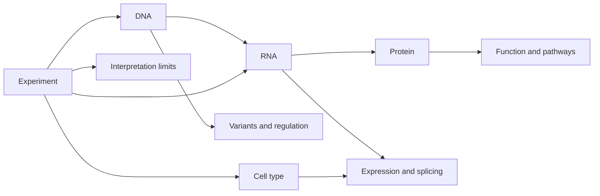

# What Biology Do You Need for Bioinformatics?

**Takeaway:** You do not need to memorize all of biology before starting bioinformatics. You do need to know what biological system was measured, what the assay can and cannot see, and what claims the data can support.

## Start With The Dataset's Story

Bioinformatics is not just coding on biological files. A result only matters if it respects the experiment that produced the data.

When you see a dataset, ask:

```text
What biological system was measured, how was it measured, and what can this assay actually support?
```

That question is more useful than memorizing a hundred gene names. It prevents the most common beginner mistake: treating every table as if it means the same thing.

A count matrix, VCF, peak file, protein table, or cell-by-gene matrix is not just "data." It is a compressed story about a biological system.

## The Five Concepts To Learn First

| Concept | Plain meaning | Why it matters |
|---|---|---|
| DNA | Genetic sequence and variation | Coordinates, variants, genes, regulatory regions |
| RNA | Transcribed molecules | Expression, splicing, regulation, cell state |
| Protein | Functional molecules | Pathways, structure, enzymes, receptors |
| Cell type | Biological context | Signals can disappear when cell types are mixed |
| Experiment | Data biography | Controls, batches, replicates, and limits of interpretation |

You do not need a PhD-level command of each concept to begin. You need enough to ask better questions before you run better code.

## DNA: The Reference Is A Coordinate System

Many workflows start by comparing reads to a reference genome. The reference is not a perfect person; it is a coordinate system that helps us organize evidence.

Learn:

- chromosomes
- genes
- exons and introns
- variants
- reference genomes
- genome annotations
- genome builds

The practical question is:

```text
Where is this signal in the genome, and are we using the right coordinate system?
```

Mixing genome builds is one of the easiest ways to create silent errors. A variant position, gene annotation, or regulatory region can shift meaning if one file uses GRCh37 and another uses GRCh38.

## RNA: Expression Depends On Context

RNA-seq often measures RNA abundance as a proxy for gene expression. But expression depends on tissue, cell type, time point, condition, protocol, and batch.

Learn:

- transcription
- splicing
- gene expression
- count matrices
- normalization
- differential expression

The practical question is:

```text
Which genes changed, in which samples, under what assumptions?
```

RNA changes are evidence. They are not automatic proof of protein change, mechanism, or clinical relevance. A good bioinformatician treats differential expression as a clue, not a conclusion.

## Proteins: Closer To Function, Still Not Simple

Proteins carry out many cellular functions, but predicting function from sequence or expression is not straightforward.

Learn:

- amino acids
- protein domains
- motifs
- protein families
- post-translational modification
- structure-function relationships

The practical question is:

```text
Does this molecular change plausibly alter function, and what evidence supports that?
```

For example, higher mRNA for a receptor does not guarantee higher surface protein. Protein abundance, localization, modification, and degradation can change the biology.

## Cells: Biology Has Location

Single-cell and spatial methods remind us that tissue is not one uniform thing. A tumor, liver sample, blood draw, or organoid may contain many cell types and states.

Learn:

- cell type
- cell state
- differentiation
- immune populations
- tissue compartments
- spatial organization

The practical question is:

```text
Which cells are driving the pattern?
```

This matters because a bulk signal can reflect a true expression change, a cell-type proportion change, or both.

## Experiments: Every Dataset Has A Biography

Before trusting any analysis, learn the dataset's biography:

- How were samples collected?
- What platform was used?
- How many biological replicates exist?
- What controls exist?
- What batches exist?
- What metadata is missing?
- What was excluded before you received the file?

If you ignore the experiment, your analysis can be elegant and wrong. The code may run perfectly while the conclusion falls apart.

## The Four-Part Dataset Question

Before opening a notebook, summarize the dataset in one sentence:

```text
In [biological system], [assay] measured [molecular signal] to compare [groups or conditions].
```

Examples:

| Dataset | One-sentence interpretation |
|---|---|
| Bulk RNA-seq in treated liver organoids | In liver organoids, RNA-seq measured gene expression to compare treated and control samples. |
| ATAC-seq in immune cells | In immune cells, ATAC-seq measured chromatin accessibility to compare stimulated and unstimulated states. |
| Whole-genome sequencing in tumors | In tumor-normal pairs, WGS measured DNA variation to identify somatic variants. |
| Single-cell RNA-seq in diseased tissue | In diseased tissue, scRNA-seq measured cell-level gene expression to compare cell types and states. |

If you cannot write this sentence, you are not ready to interpret the analysis yet.

## A Beginner Biology Map



The reusable worksheet for this post is here: [`content/resources/week-03/biology-sanity-check.md`](https://github.com/Caffeinated-Code/Bioinformatics-Field-Guide/blob/main/content/resources/week-03/biology-sanity-check.md).

## Common Mistakes

- Treating gene symbols as stable and universal.
- Forgetting that annotations change.
- Assuming RNA changes equal protein changes.
- Ignoring batch effects.
- Confusing correlation with mechanism.
- Overinterpreting one dataset.
- Forgetting that missing metadata limits every downstream claim.
- Forgetting that an assay measures a proxy, not biology itself.

## Save This: The Biology Sanity Check

Before analyzing a dataset, answer:

| Question | Better version of the question | Why it matters |
|---|---|---|
| What organism and genome build? | Human GRCh38? Mouse GRCm39? Something else? | Prevents coordinate and annotation errors |
| What tissue or cell type? | Liver tissue, hepatocytes, immune cells, tumor cells? | Gives biological context |
| What assay? | RNA-seq, ATAC-seq, WGS, proteomics, scRNA-seq? | Defines what can be measured |
| What comparison? | Treated vs control, disease vs healthy, responder vs non-responder? | Prevents vague analysis |
| What replicates and controls? | How many biological replicates per condition? | Determines statistical strength |
| What metadata is missing? | Batch, sex, age, tissue source, protocol, time point? | Defines interpretation limits |
| What claim is allowed? | Association, differential signal, mechanism, biomarker, target? | Prevents overinterpretation |

## What To Watch Next

Computational biology is moving toward multimodal data: sequence, chromatin, RNA, protein, imaging, and perturbation readouts in the same biological system. The analysts who thrive will understand enough biology to know when a computational result is surprising, impossible, underpowered, or useful.

Week 4 will turn this into a working mindset: how to think like a bioinformatician when biology, statistics, and software all disagree a little.

## Credits and References

- NCBI Bookshelf: https://www.ncbi.nlm.nih.gov/books/
- Ensembl genome browser: https://www.ensembl.org/
- UCSC Genome Browser: https://genome.ucsc.edu/
- Gene Ontology Consortium: https://geneontology.org/
- UniProt: https://www.uniprot.org/
- EMBL-EBI training: https://www.ebi.ac.uk/training/
- GENCODE: https://www.gencodegenes.org/
- Human Cell Atlas: https://www.humancellatlas.org/
