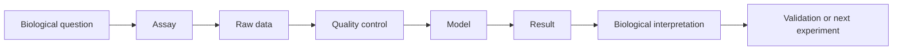

# How to Think Like a Bioinformatician

**Takeaway:** Bioinformatics is the habit of asking whether a biological signal is real, measurable, reproducible, and useful.

## Tools Are Not The Center

A beginner often asks, "Which tool should I run?" A strong analyst first asks:

```text
What question am I trying to answer, and what evidence would convince me?
```

Tools matter, but they are not the analysis. The analysis is the chain of reasoning from biological question to data, model, result, and interpretation.

## The Four Questions

When you see any bioinformatics result, ask:

1. What biological question is being asked?
2. What data was generated to answer it?
3. What assumptions connect the data to the question?
4. What would change my mind?

If you cannot answer those four questions, the result is not ready to trust.

## Biology First

Start with the biological contrast:

- disease vs control
- treated vs untreated
- responder vs non-responder
- cell type A vs cell type B
- time point 1 vs time point 2

If the contrast is unclear, the analysis will drift. A beautiful plot cannot rescue a vague question.

## Assay Second

Ask what the experiment can measure.

| Assay | Measures | Cannot prove alone |
|---|---|---|
| RNA-seq | RNA abundance | mechanism or protein function |
| ATAC-seq | chromatin accessibility | transcriptional activity by itself |
| ChIP-seq | protein-DNA occupancy or histone marks | direct gene regulation without context |
| WGS | DNA sequence variation | functional impact without evidence |
| single-cell RNA-seq | expression by cell | independent biological replication per cell |

The assay defines the ceiling of the claim.

## Statistics Third

Statistics separates signal from noise, but it does not fix weak design.

Before modeling, ask:

- How many biological replicates exist?
- Are samples independent?
- What batch effects might exist?
- Were covariates measured?
- How many hypotheses were tested?
- Are labels reliable?

The model is only as useful as the design it represents.

## Skepticism Always

Good skepticism is not negativity. It is respect for how easy it is to fool yourself with high-dimensional data.

Ask:

- Does this pattern survive another reasonable normalization?
- Does it appear in an independent dataset?
- Is it driven by one outlier?
- Is batch confounded with condition?
- Is the label circular?
- Is there a simpler explanation?

## The Thinking Framework



At each arrow, write down what could go wrong.

## A Tiny Example

Suppose PC1 separates disease and control samples in an RNA-seq dataset.

A weak interpretation is:

```text
Disease changes the transcriptome.
```

A stronger interpretation is:

```text
PC1 separates disease and control samples, but we need to check whether disease is confounded with batch, sex, tissue quality, sequencing depth, or cell-type composition before treating it as biological signal.
```

The second version is less flashy and much more useful.

## Common Mistakes

- Starting with a tool instead of a question.
- Treating default parameters as truth.
- Confusing statistical significance with biological importance.
- Ignoring negative results.
- Making mechanistic claims from descriptive data.
- Forgetting to ask whether the result is actionable.

## Save This: Result Stress Test

| Check | Question |
|---|---|
| Question | Is the biological contrast clear? |
| Assay | Can this assay answer the question? |
| Metadata | Are key covariates available? |
| QC | Are samples and features behaving as expected? |
| Model | Are assumptions visible? |
| Result | Is effect size meaningful, not just significant? |
| Interpretation | Is the claim proportional to evidence? |
| Validation | What would strengthen or refute the result? |

## What To Watch Next

Automation is useful, but it can hide assumptions. The best analysts automate execution while keeping interpretation deliberate. If a workflow produces results faster than the team can reason about them, the workflow is not finished.

## Credits and References

- Bioconductor workflows: https://www.bioconductor.org/help/workflows/
- Nature reporting standards: https://www.nature.com/nature-portfolio/editorial-policies/reporting-standards
- NIH rigor and reproducibility: https://www.nih.gov/research-training/rigor-reproducibility
- The Turing Way: https://the-turing-way.netlify.app/
