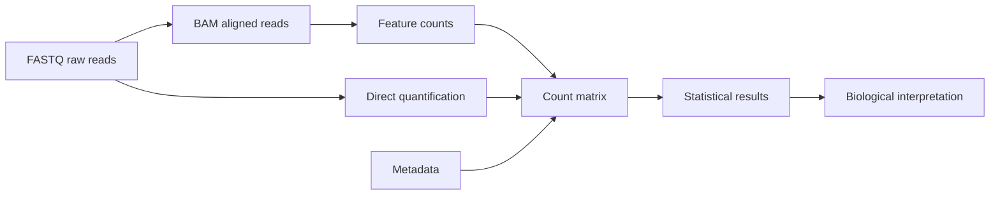

# The Bioinformatics File Types You Must Know

**Takeaway:** Bioinformatics files are not random extensions. Each file type represents a stage in the path from raw measurement to biological interpretation.

## Why File Types Matter

Many beginner mistakes happen before any statistics are run:

- opening huge files in the wrong program
- mixing genome builds
- losing the sample sheet
- using gene symbols when stable IDs are needed
- treating processed files as raw files

If you know what each file type represents, the workflow becomes much easier to reason about.

## The Big Picture



The files change because the question changes:

```text
What was sequenced? -> Where did it align? -> What feature was counted? -> What changed?
```

## FASTQ: Raw Sequencing Reads

FASTQ stores sequencing reads and quality scores. It is often the first file you receive after sequencing.

```text
@read_id
ACGTACGTACGT
+
FFFFFFFFFFFF
```

The sequence line contains bases. The quality line estimates confidence in each base call.

Use FASTQ for:

- quality control
- trimming
- alignment
- quantification

Do not edit FASTQ files by hand.

## SAM And BAM: Where Reads Align

SAM is a text format for aligned sequencing reads. BAM is the compressed binary version. These files answer:

```text
Where did each read align?
```

Use BAM for:

- viewing alignments
- checking coverage
- counting reads over genomic features
- variant calling

BAM files are usually indexed. If a tool complains about a missing `.bai` file, it is asking for the BAM index.

## VCF: Genetic Variants

VCF stores variants such as single nucleotide variants, insertions, deletions, and structural variants.

It usually includes:

- genomic position
- reference allele
- alternate allele
- quality information
- genotype information

Use VCF for variant interpretation, population genetics, filtering, and clinical genetics workflows.

The big caution: variant interpretation depends heavily on reference genome, annotation version, filtering logic, and clinical context.

## GTF And GFF: Genome Annotation

GTF and GFF files describe genomic features:

- genes
- transcripts
- exons
- coding regions
- other annotated elements

They help tools connect genomic coordinates to biological labels.

Use annotation files for:

- counting reads per gene
- transcript analysis
- feature overlap
- gene model interpretation

Always record which annotation version you used.

## Count Matrix: Where Many Analyses Begin

For RNA-seq and single-cell RNA-seq, statistical analysis often begins with a count matrix.

```text
gene_id    sample_1    sample_2    sample_3
GeneA      10          25          18
GeneB      0           4           1
GeneC      100         88          140
```

Rows are usually genes or features. Columns are samples or cells. Values are counts.

Counts without metadata are just numbers.

## Metadata: The File People Forget

Metadata describes samples:

```text
sample_id    condition    batch    tissue
S1           control      A        liver
S2           treated      A        liver
S3           control      B        liver
```

Metadata tells the analysis what the columns mean. It is where condition, batch, tissue, donor, time point, and covariates live.

If the metadata is wrong, the analysis will be wrong in a very quiet way.

## Save This: File Format Atlas

| File | Stage | Human-readable? | Beginner warning |
|---|---|---:|---|
| FASTQ | raw reads | yes | do not edit by hand |
| SAM | aligned reads | yes | can be very large |
| BAM | aligned reads | no | usually needs an index |
| VCF | variants | yes | interpretation depends on annotation |
| GTF/GFF | annotation | yes | version matters |
| count matrix | summarized features | yes | must match metadata |
| sample sheet | metadata | yes | protect it like data |

## Common Mistakes

- Opening huge files in spreadsheet software.
- Mixing genome builds.
- Forgetting BAM indexes.
- Losing the sample sheet.
- Treating filtered files as raw files.
- Using gene symbols when stable IDs are needed.
- Sharing human genomic data without checking privacy rules.

## What To Watch Next

File formats are stable, but the way teams store, stream, validate, and document data is still evolving. Cloud-native workflows, metadata standards, and provenance tracking are becoming as important as the files themselves.

## Credits and References

- SAM/BAM specification: https://samtools.github.io/hts-specs/SAMv1.pdf
- VCF specification: https://samtools.github.io/hts-specs/VCFv4.3.pdf
- Sequence Ontology GFF/GTF specifications: https://github.com/The-Sequence-Ontology/Specifications
- FastQC: https://www.bioinformatics.babraham.ac.uk/projects/fastqc/
- Bioconductor RNA-seq workflow: https://www.bioconductor.org/packages/release/workflows/vignettes/rnaseqGene/inst/doc/rnaseqGene.html
