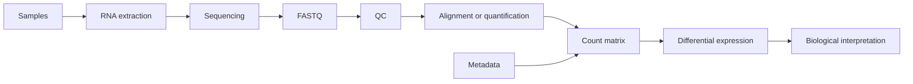

# RNA-seq in 7 Minutes

**Takeaway:** RNA-seq turns RNA fragments into a count matrix, then uses statistics to ask which genes differ across biological conditions.

## What RNA-seq Measures

RNA-seq measures RNA abundance. It does not directly measure protein abundance, enzyme activity, mechanism, or clinical relevance.

That limitation does not make RNA-seq weak. It makes interpretation important.

## The Workflow



Every arrow is a place where bias can enter.

## Step 1: Experimental Design

Before sequencing, decide:

- What condition is being compared?
- What tissue, cell type, or time point matters?
- How many biological replicates are needed?
- What batches might exist?
- What covariates should be recorded?
- What result would be biologically useful?

Analysis cannot rescue a weak design.

## Step 2: FASTQ Quality Control

FASTQ files should be checked for:

- base quality
- adapter contamination
- duplication
- overrepresented sequences
- read length

FastQC and MultiQC are commonly used to summarize quality. The goal is not to panic at every warning. The goal is to understand whether the data is fit for the planned analysis.

## Step 3: Alignment Or Quantification

There are two common paths:

| Path | Example tools | Typical output |
|---|---|---|
| Align reads to a genome | STAR, HISAT2 | BAM files |
| Quantify transcripts directly | Salmon, kallisto | transcript abundance |

Both can lead to gene-level analysis, but assumptions differ. Record the tool, version, reference, and annotation.

## Step 4: Count Matrix Plus Metadata

Most differential expression workflows use a matrix of counts per gene per sample.

```text
gene_id    control_1    control_2    treated_1    treated_2
GeneA      10           12           31           29
GeneB      0            1            0            2
GeneC      100          95           104          110
```

The count matrix must match metadata:

```text
sample_id    condition    batch
control_1    control      A
control_2    control      B
treated_1    treated      A
treated_2    treated      B
```

Without metadata, the model does not know what comparison to test.

## Step 5: Differential Expression

Tools such as DESeq2, edgeR, and limma-voom model count data and test whether genes differ between conditions.

The output usually includes:

- gene ID
- log fold change
- p-value
- adjusted p-value
- average expression

The adjusted p-value matters because thousands of genes are tested.

## Step 6: Interpretation

Differential expression is not the endpoint. Ask:

- Are the top genes biologically plausible?
- Is the effect size meaningful?
- Are results driven by one sample?
- Do pathway results match the gene-level result?
- Is validation needed?

The safest phrase is often:

```text
This result suggests a transcriptional change consistent with...
```

That is stronger than overclaiming mechanism.

## Common Mistakes

- Comparing technical replicates as if they were biological replicates.
- Ignoring batch effects.
- Filtering genes after looking at results.
- Reporting only p-values without effect sizes.
- Treating RNA change as proof of mechanism.
- Forgetting gene annotation version.
- Losing the sample sheet.

## Save This: RNA-seq QC Map

| Stage | Check |
|---|---|
| Design | biological replicates, batches, covariates |
| FASTQ | read quality, adapters, read length |
| Reference | genome build, annotation version |
| Quantification | mapping rate, assignment rate |
| Count matrix | sample names match metadata |
| Model | design formula matches question |
| Result | effect size, adjusted p-value, sample consistency |
| Interpretation | claim does not exceed evidence |

## What To Watch Next

Experts still debate transcript-level vs gene-level analysis, alignment vs lightweight quantification, best normalization strategies for unusual designs, and how to integrate RNA-seq with proteomics or single-cell data.

## Credits and References

- Bioconductor RNA-seq workflow: https://www.bioconductor.org/packages/release/workflows/vignettes/rnaseqGene/inst/doc/rnaseqGene.html
- DESeq2 paper: https://genomebiology.biomedcentral.com/articles/10.1186/s13059-014-0550-8
- FastQC: https://www.bioinformatics.babraham.ac.uk/projects/fastqc/
- MultiQC: https://multiqc.info/
- Salmon: https://combine-lab.github.io/salmon/
- kallisto: https://pachterlab.github.io/kallisto/
