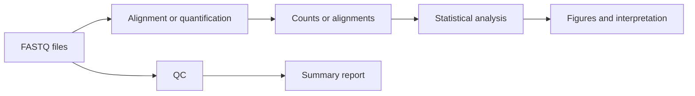
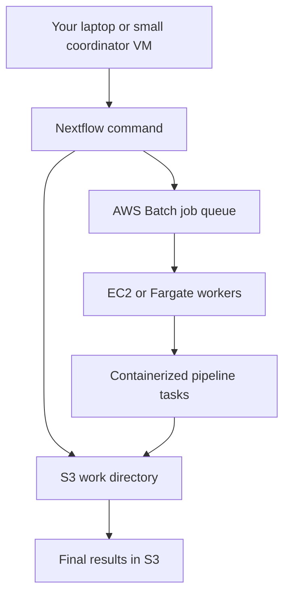

# Nextflow, Snakemake, WDL, Or CWL? Choosing Workflow Tools And Running Nextflow On AWS

**Takeaway:** Nextflow is not the only workflow manager, but it is one of the strongest choices when you need one pipeline to run on a laptop, HPC, and cloud with containers, caching, and many samples.

In [Week 5](week-05-nextflow-nfcore-rnaseq.html), we used Nextflow from the user side. In [Week 6](week-06-build-custom-nextflow-ont-pipeline.html), we built a small custom ONT pipeline. Now zoom out: when should you use Nextflow, when should you consider alternatives, and how do you avoid wasting money when you run on AWS?

## The Problem Workflow Tools Solve

A bioinformatics workflow manager is useful when your project stops being one command and becomes a dependency graph:


```mermaid
flowchart LR
  fastq["FASTQ files"] --> qc["QC"]
  fastq --> align["Alignment or quantification"]
  align --> counts["Counts or alignments"]
  qc --> multiqc["Summary report"]
  counts --> stats["Statistical analysis"]
  stats --> report["Figures and interpretation"]
```

Without a workflow manager, people often lose track of:

| Pain point | What breaks |
|---|---|
| manual reruns | one sample is processed differently from the others |
| hidden software versions | results change after an update |
| weak file naming | outputs cannot be traced back to inputs |
| partial failures | failed samples are silently skipped |
| cloud scaling | costs rise before anyone understands why |

A good workflow tool makes the dataflow explicit. It does not make the biology correct by itself.

## The Short Comparison

| Tool | Best fit | Strength | Watch out |
|---|---|---|---|
| Nextflow | omics pipelines that must run locally, on HPC, and on cloud | channels, process isolation, strong container support, nf-core ecosystem | DSL2 has a learning curve; cloud profiles need careful setup |
| Snakemake | Python-friendly projects, file-based rules, academic lab workflows | readable rule syntax, strong Conda integration, reports, broad adoption | cloud/HPC behavior depends on executor profiles and project discipline |
| WDL + Cromwell | clinical-style production workflows, Broad/GATK/Terra ecosystems | explicit task inputs/outputs, strong genomics history | less beginner-friendly if you are not already in WDL/Terra ecosystems |
| CWL | portable, standards-driven workflows across engines | open standard, vendor-neutral, strong emphasis on interoperability | verbose for beginners; less common than Nextflow/Snakemake in some wet-lab-facing teams |
| Bash scripts | tiny one-off checks | fast, direct, no framework overhead | fragile once samples, versions, and reruns matter |

My practical recommendation:

```text
Use Bash to learn commands.
Use Snakemake if your lab thinks in Python and file rules.
Use WDL when the ecosystem already expects WDL.
Use CWL when standards-based portability is the priority.
Use Nextflow when portability, containers, cloud, and nf-core matter together.
```

## Why Nextflow Often Wins For Omics

Nextflow is especially strong for omics because it separates three things that beginners often mix together:

| Layer | Example |
|---|---|
| workflow logic | "FASTQ QC runs before alignment" |
| execution backend | local, Slurm, AWS Batch, Google Batch, Kubernetes |
| software environment | Docker, Singularity/Apptainer, Conda |

That separation is the magic. You can write pipeline logic once, then change where it runs by changing a profile.

```nextflow
profiles {
  local {
    process.executor = 'local'
  }

  awsbatch {
    process.executor = 'awsbatch'
    process.queue = 'nextflow-demo-queue'
    workDir = 's3://your-bucket/nextflow-work/demo'
    aws.region = 'us-west-2'
  }
}
```

Nextflow also caches completed tasks. If a run fails after alignment, `-resume` can reuse completed work instead of starting everything again. That is a scientific and financial feature.

## How Nextflow Runs On AWS

On AWS, Nextflow usually runs like this:


```mermaid
flowchart TB
  user["Your laptop or small coordinator VM"] --> nf["Nextflow command"]
  nf --> s3["S3 work directory"]
  nf --> batch["AWS Batch job queue"]
  batch --> ec2["EC2 or Fargate workers"]
  ec2 --> tasks["Containerized pipeline tasks"]
  tasks --> s3
  s3 --> results["Final results in S3"]
```

Plain English:

| Component | Role |
|---|---|
| Nextflow coordinator | reads the pipeline, submits tasks, tracks state |
| AWS Batch | schedules container jobs and provisions compute |
| EC2 or Fargate | runs the actual tools inside containers |
| S3 | stores inputs, intermediate work files, and final outputs |
| IAM | controls what the coordinator and workers are allowed to access |

The key point: AWS Batch does not make your pipeline free. It helps run tasks at scale. You still pay for the AWS resources used underneath, although AWS Batch itself has no extra job-scheduling charge.

## Cost And Time Best Practices

Use these habits before running real data:

| Practice | Why it saves money or time |
|---|---|
| start with `-profile test` or one tiny samplesheet | catches config errors before full data runs |
| use `-resume` | avoids rerunning completed tasks |
| publish only final outputs | prevents huge intermediate uploads |
| use S3 lifecycle rules on work buckets | removes stale work files after a chosen retention period |
| set process-specific CPUs and memory | avoids overpaying for small tasks and under-provisioning large tasks |
| choose Spot only for retry-safe tasks | lowers cost but can be interrupted |
| inspect `trace.txt`, `timeline.html`, and `report.html` | shows slow, memory-heavy, or repeatedly retried steps |
| avoid giant shared references in every task when possible | staging large files repeatedly wastes time |
| pin pipeline versions and containers | prevents unplanned changes |
| set budgets and alerts before the first cloud run | protects learners from surprise spending |

For real projects, treat cost like a QC metric. A pipeline that gives the right answer once but cannot be rerun affordably is not production-ready.

## A Credit-Bounded AWS Learning Path

As of September 2026, AWS describes its Free Tier for new customers as credit-based, with up to USD 200 in credits over 6 months depending on plan and activities. AWS service access differs by account plan, and cloud offers change. Check the current AWS Free Tier page before writing any tutorial that promises "free."

Safer wording for readers:

```text
This is a tiny AWS Batch learning run designed to stay within new-account credits.
It is not a guarantee of zero cost for every account.
Set a budget alert first.
Delete resources when finished.
```

Best AWS service for real Nextflow execution: **AWS Batch**. It is the native AWS executor documented by Nextflow and is designed for containerized batch jobs.

## Tutorial: Local First, AWS Second

Start with a tiny local command:

```bash
# Create the Week 7 demo folder.
mkdir -p nextflow-aws-demo
cd nextflow-aws-demo

# Create the smallest possible Nextflow script.
cat > main.nf <<'EOF'
process SAY_HELLO {
  output:
  path "hello.txt"

  script:
  """
  echo "hello from Nextflow" > hello.txt
  """
}

workflow {
  SAY_HELLO()
}
EOF

# Run locally first. This should cost nothing beyond your laptop.
nextflow run main.nf
```

Expected output:

```text
executor >  local
[.../...] process > SAY_HELLO [100%] 1 of 1
```

Check the result:

```bash
cat work/*/*/hello.txt
```

Expected:

```text
hello from Nextflow
```

Now add an AWS profile:

```nextflow
profiles {
  awsbatch {
    process.executor = 'awsbatch'
    process.queue = 'YOUR_AWS_BATCH_QUEUE'
    workDir = 's3://YOUR_BUCKET/nextflow-work/hello'
    aws.region = 'us-west-2'
    docker.enabled = true
    process.container = 'public.ecr.aws/docker/library/bash:5.2'
  }
}
```

Save that as `nextflow.config`. Then run only after AWS Batch, S3, IAM, and budget alerts are configured:

```bash
nextflow run main.nf -profile awsbatch
```

If you are learning, stop here. This tiny run proves the coordinator can submit to AWS Batch, the worker can run a container, and S3 can store work files. Do not test cloud infrastructure for the first time with a full RNA-seq or long-read dataset.

## AWS Checklist Before Running Real Data

| Check | Beginner-friendly reason |
|---|---|
| AWS Budget alert exists | you get warned before credits disappear |
| S3 bucket is in the same region as Batch | avoids avoidable latency and transfer confusion |
| `workDir` is an S3 path | AWS Batch workers need shared cloud storage |
| every process has a container | Batch workers should not depend on random local software |
| queue name is correct | Nextflow submits tasks to that queue |
| IAM permissions are minimal but sufficient | workers need S3 access, not unlimited power |
| final `outdir` is separate from `workDir` | final results are easier to preserve and share |
| test run passes before real data | protects money and time |

## When Not To Use AWS

Use local or HPC instead when:

- the dataset fits comfortably on your laptop
- you are still debugging commands
- protected data cannot leave an approved environment
- your institution already has a well-supported cluster
- the cloud setup would take longer than the analysis

Cloud is a scaling tool, not a badge of seriousness.

## What To Save From Every Workflow Run

For reproducibility, archive:

| Artifact | Why it matters |
|---|---|
| exact command | proves how the run was launched |
| pipeline version or commit | identifies the code |
| params file | records scientific choices |
| samplesheet | links outputs to samples |
| software versions | catches hidden environment drift |
| `trace.txt` | resource and runtime audit |
| `report.html` | run summary |
| final MultiQC or QC reports | biological and technical interpretation |

That habit prepares you for Week 8, where we turn workflow trust into automated checks.

## Next In The Series

Week 8 will cover CI/CD in bioinformatics: how to test pipelines, validate small datasets, run GitHub Actions, pin environments, publish releases, and keep scientific code from silently breaking.

## Credits and References

- Nextflow documentation: https://docs.seqera.io/nextflow/
- Nextflow executors documentation: https://www.nextflow.io/docs/latest/executor.html
- Nextflow AWS documentation: https://www.nextflow.io/docs/latest/aws.html
- nf-core documentation: https://nf-co.re/
- Snakemake documentation: https://snakemake.readthedocs.io/
- Common Workflow Language: https://www.commonwl.org/
- WDL specification: https://github.com/openwdl/wdl
- Cromwell documentation: https://cromwell.readthedocs.io/
- AWS Free Tier: https://aws.amazon.com/free/
- AWS Batch pricing: https://aws.amazon.com/batch/pricing/
