# Single-Cell RNA-seq vs Bulk RNA-seq

**Takeaway:** Bulk RNA-seq summarizes expression across many cells, while single-cell RNA-seq measures many individual cells and shifts the question from "what changed overall?" to "which cells changed?"

## The Simple Difference

Bulk RNA-seq blends many cells together. Single-cell RNA-seq tries to measure individual cells separately.

| Question | Bulk RNA-seq | Single-cell RNA-seq |
|---|---|---|
| Unit | sample | cell |
| Main output | gene by sample matrix | gene by cell matrix |
| Strength | robust condition-level expression | cell-type and cell-state resolution |
| Challenge | mixed cell populations | sparsity, noise, annotation, scale |

Neither is automatically better. They answer different questions.

## Why Single-Cell Changed The Field

Single-cell RNA-seq helps reveal:

- rare cell types
- cell states
- immune populations
- tumor heterogeneity
- developmental trajectories
- treatment response within subpopulations

It is powerful because biology often happens in specific cells, not averaged tissue.

## The Workflow

```mermaid
flowchart LR
  cells[Cells] --> barcoding[Barcoding]
  barcoding --> sequencing[Sequencing]
  sequencing --> matrix[Count matrix]
  matrix --> qc[QC]
  qc --> normalization[Normalization]
  normalization --> reduction[Dimensionality reduction]
  reduction --> clustering[Clustering]
  clustering --> annotation[Annotation]
  annotation --> interpretation[Biological interpretation]
```

Each step contains choices that can change the result.

## The Hard Part: Annotation

Clusters do not name themselves. Analysts often use marker genes, reference atlases, label-transfer tools, or expert knowledge to annotate cell types.

Ask:

- Are marker genes specific?
- Is the reference appropriate?
- Could this cluster be a cell state, not a cell type?
- Does annotation match tissue biology?
- Are doublets or low-quality cells driving the cluster?

Automated annotation is useful, but it is not a substitute for biological review.

## Pseudobulk: A Useful Bridge

For differential expression, many experts prefer pseudobulk approaches: aggregate counts by sample and cell type, then use bulk RNA-seq statistical tools.

Why? Because single cells from the same person, mouse, or sample are not independent biological replicates.

The unit of replication matters.

## UMAP Is A Map, Not A Microscope

UMAP and t-SNE plots are helpful visual summaries, but distances can be misleading.

Do not assume:

- nearby clusters are always biologically similar
- distant clusters are always unrelated
- cluster shape has direct biological meaning
- a UMAP plot validates cell identity

Use UMAP to explore. Use markers, metadata, validation, and domain knowledge to interpret.

## Common Mistakes

- Treating every cell as an independent replicate.
- Overtrusting automated annotations.
- Ignoring doublets and low-quality cells.
- Choosing clustering resolution without biological reasoning.
- Treating UMAP distance as exact biology.
- Comparing cell types without enough samples.
- Forgetting that integration can remove real biology if misused.

## Save This: Bulk vs Single-Cell Decision Map

| If your question is... | Consider |
|---|---|
| What changed overall between conditions? | bulk RNA-seq |
| Which cell type drives the signal? | single-cell RNA-seq |
| Do I need strong sample-level statistics? | bulk or pseudobulk |
| Do I need rare population discovery? | single-cell RNA-seq |
| Do I have few samples but many cells? | be cautious; cells are not replicates |
| Do I need spatial context? | spatial transcriptomics or validation |

## What To Watch Next

Experts debate normalization, integration, batch correction, clustering resolution, annotation standards, differential expression methods, and validation of cell states. The next frontier is not prettier plots. It is stronger biological conclusions.

## Credits and References

- Seurat documentation: https://satijalab.org/seurat/
- Seurat PBMC tutorial: https://satijalab.org/seurat/articles/pbmc3k_tutorial
- Scanpy documentation: https://scanpy.readthedocs.io/
- Single Cell Expression Atlas: https://www.ebi.ac.uk/gxa/sc/home
- 10x Genomics resources: https://www.10xgenomics.com/resources
- muscat pseudobulk workflows: https://bioconductor.org/packages/release/bioc/html/muscat.html
